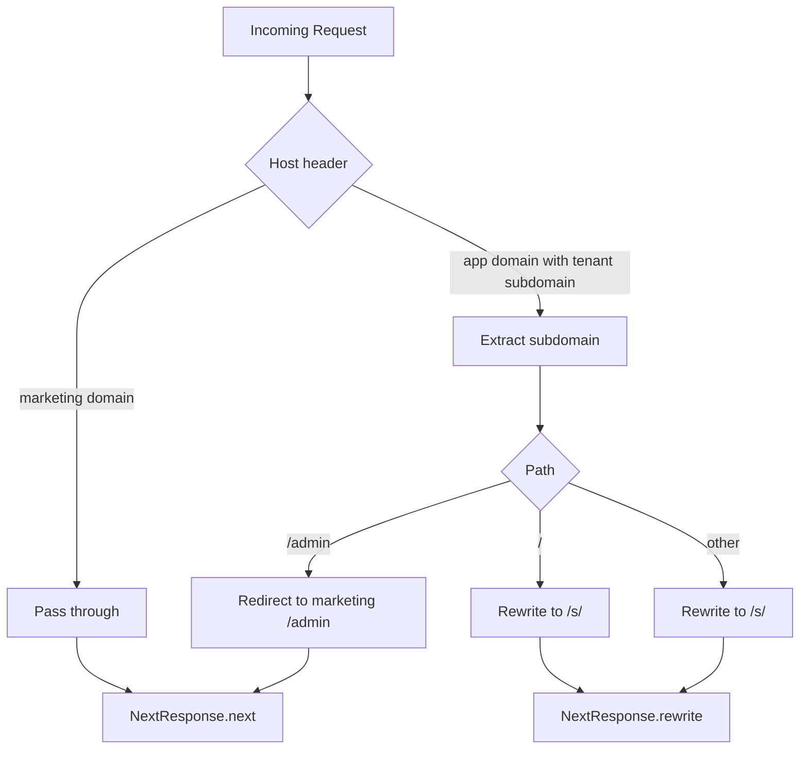
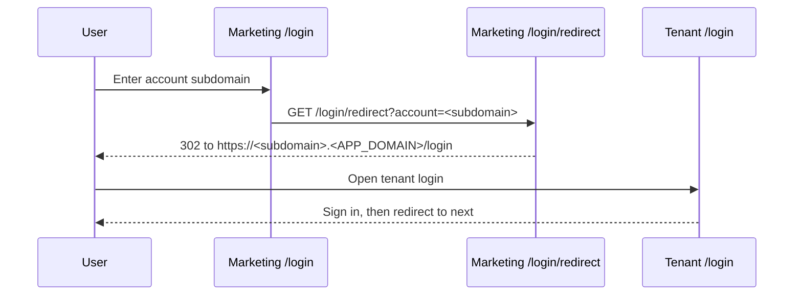
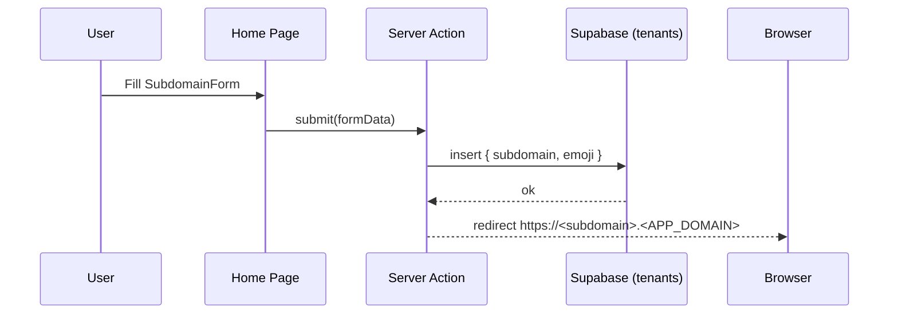

# Subdomain-Isolated Turborepo

A multi-tenant Turborepo built with Next.js 15, featuring custom subdomains for each tenant and a shared UI component library.

## Features

- ✅ Custom subdomain routing with Next.js middleware
- ✅ Tenant‑specific content and pages
- ✅ Shared UI components via workspace package
- ✅ Marketing site for tenant discovery
- ✅ Protected tenant applications
- ✅ Local development with subdomains
- ✅ TypeScript support across all packages
- ✅ ESLint configuration shared across packages

## Turborepo layout

```
apps/
  marketing/        # Public marketing site and tenant discovery
  protected/        # Tenant app with subdomain routing middleware
packages/
  ui/              # Shared UI components and utilities
  eslint-config/   # Shared ESLint configurations
  typescript-config/ # Shared TypeScript configurations
```

## Tech Stack

- [Next.js 15](https://nextjs.org/) with App Router
- [React 19](https://react.dev/)
- [Tailwind CSS 4](https://tailwindcss.com/) for styling
- [shadcn/ui](https://ui.shadcn.com/) for the design system
- [Radix UI](https://www.radix-ui.com/) for accessible components
- [Lucide React](https://lucide.dev/) for icons
- [TypeScript](https://www.typescriptlang.org/) for type safety

## Getting Started

### Prerequisites

- Node.js 20 or later
- pnpm (recommended package manager)

### Installation

1. Clone your repository and cd into it.

2. Install dependencies:

   ```bash
   pnpm install
   ```

3. Start the development server(s):

   You can run all apps at once or individually:
   - Run all apps:

     ```bash
     pnpm dev
     ```

   - Run individual apps:

     ```bash
     # Marketing app (port 3000)
     pnpm --filter marketing dev

     # Protected app (port 3001)
     pnpm --filter protected dev
     ```

4. Access the application:
   - Marketing site: http://localhost:3002
   - Protected app: http://localhost:3003
   - Tenant subdomains: http://[tenant].localhost:3003

## Multi‑Tenant Architecture

This application demonstrates a **subdomain‑based multi‑tenant architecture** with strict domain separation and **clean URL routing**:

### Domain Structure

- **Marketing Site**: `https://bask-app.com` - Landing page, signup, and tenant discovery
- **Tenant Apps**: `https://[company].ghostwrite.app` - Individual workspace applications
- **Base App Domain**: `https://ghostwrite.app` - Redirects to marketing site (no subdomain access)

### Key Features

- Each tenant gets their own subdomain (`company.ghostwrite.app`)
- Users see clean URLs like `company.ghostwrite.app/admin` instead of `ghostwrite.app/s/company/admin`
- The middleware handles transparent routing between clean URLs and internal file structure
- Strict domain separation: marketing on `bask-app.com`, workspaces on `*.ghostwrite.app`
- Session evaluation on protected app homepage redirects based on subdomain presence
- Subdomains are dynamically mapped to tenant-specific content with proper authentication
- Shared UI components are available across all apps via the workspace package

### Clean URL Routing System

The middleware (`apps/protected/middleware.ts`) provides a **clean URL façade** that works as follows:

1. **User Experience**: Clean, professional URLs
   - `https://company.ghostwrite.app/auth/login`
   - `https://company.ghostwrite.app/admin`
   - `https://company.ghostwrite.app/dashboard`

2. **Internal Routing**: Middleware rewrites to Next.js file structure
   - Extracts subdomain from hostname (`company`)
   - Rewrites `/auth/login` → `/s/company/auth/login` internally
   - Routes to `apps/protected/app/s/[subdomain]/auth/login/page.tsx`

3. **Benefits**:
   - Professional URLs that don't expose internal routing structure
   - Proper subdomain isolation for multi-tenant security
   - SEO-friendly URLs for each tenant
   - Clean bookmarkable links

### Authentication Flow

- **Domain-Based Flow**: Users start at `bask-app.com` for tenant discovery
- **Session Evaluation**: Protected app homepage evaluates subdomain presence and user session
- **No Subdomain Redirect**: `ghostwrite.app` (base domain) → `bask-app.com`
- **Supabase Integration**: Row-level security and user authentication
- **Tenant Isolation**: Each subdomain has its own authentication context
- **Session Management**: Automatic redirects and session validation
- **Clean URLs**: All auth flows use clean URLs (`/auth/login`, `/reset-password`)
- **Middleware Protection**: Unauthenticated users are redirected appropriately

The system intelligently detects subdomains across various environments (local development, production, and Vercel preview deployments) and maintains clean URL structure while preserving Next.js routing capabilities.

## Available Scripts

- `pnpm dev` - Start all development servers
- `pnpm build` - Build all packages and apps
- `pnpm lint` - Run linting across all packages
- `pnpm format` - Format code with Prettier

## Mermaid diagrams

Tenant routing decision (marketing vs app domains):



Marketing login flow (account picker to tenant login):



Create tenant flow (emoji + subdomain):



## Deployment

This repository deploys two Next.js apps to Vercel from the same GitHub repo using Turborepo and pnpm workspaces.

- Project A (Marketing):
  - Root Directory: `apps/marketing`
  - Install Command: `corepack enable pnpm && pnpm install --frozen-lockfile`
  - Build Command: `next build`
  - Node.js: 20
  - Domains: `bask-app.com`

- Project B (Protected / Tenants):
  - Root Directory: `apps/protected`
  - Install Command: `corepack enable pnpm && pnpm install --frozen-lockfile`
  - Build Command: `next build`
  - Node.js: 20
  - Domains: `ghostwrite.app` and wildcard `*.ghostwrite.app` (DNS CNAME to Vercel)

### Environment Variables

Set these in both Vercel projects (and locally via `.env.local`):

- `NEXT_PUBLIC_APP_DOMAIN=ghostwrite.app` (for the protected app)
- `NEXT_PUBLIC_MARKETING_DOMAIN=bask-app.com` (for marketing redirects)
- `NEXT_PUBLIC_ROOT_DOMAIN=bask-app.com` (root domain reference)

After connecting both projects to the same repo with the Root Directory settings above, push to `main` to trigger builds.
