# Subdomain-Isolated Turborepo

A multi-tenant Turborepo built with Next.js 15, featuring custom subdomains for each tenant and a shared UI component library.

## Features

- ✅ Custom subdomain routing with Next.js middleware
- ✅ Tenant‑specific content and pages
- ✅ Shared UI components via workspace package
- ✅ Marketing site for tenant discovery
- ✅ Protected tenant applications
- ✅ Local development with subdomains
- ✅ TypeScript support across all packages
- ✅ ESLint configuration shared across packages

## Turborepo layout

```
apps/
  marketing/        # Public marketing site and tenant discovery
  protected/        # Tenant app with subdomain routing middleware
packages/
  ui/              # Shared UI components and utilities
  eslint-config/   # Shared ESLint configurations
  typescript-config/ # Shared TypeScript configurations
```

## Tech Stack

- [Next.js 15](https://nextjs.org/) with App Router
- [React 19](https://react.dev/)
- [Tailwind CSS 4](https://tailwindcss.com/) for styling
- [shadcn/ui](https://ui.shadcn.com/) for the design system
- [Radix UI](https://www.radix-ui.com/) for accessible components
- [Lucide React](https://lucide.dev/) for icons
- [TypeScript](https://www.typescriptlang.org/) for type safety
- [Supabase UI](https://supabase.com/ui/docs/getting-started/introduction) for authentication components

## 🏗️ Built on Supabase UI Components

This project leverages the **Supabase UI component library** - a flexible, open-source, React-based UI component library built on shadcn/ui, designed to simplify Supabase-powered projects with pre-built Auth, Storage, and Realtime features.

### Authentication Foundation

The authentication system is built using Supabase's password-based auth registry:

```bash
npx shadcn@latest add https://supabase.com/ui/r/password-based-auth-nextjs.json
```

This provides:

- 🔐 **Pre-built Auth Components**: Login, signup, password reset forms
- 🎨 **Consistent Design**: Built on shadcn/ui design system
- 🔧 **Extensible**: Modify and extend components as needed
- 🏗️ **Composable**: Modular structure for easy integration
- 🚀 **Production Ready**: Scaffolding for complex auth flows

Learn more about the Supabase UI component library at [supabase.com/ui](https://supabase.com/ui/docs/getting-started/introduction).

### 🗄️ Database Structure

The project includes a complete multi-tenant database setup script (`database-setup.sql`) that creates:


**Key Features:**

- 🏢 **Organizations**: Company/group management
- 🌐 **Tenants**: Subdomain to organization mapping
- 👤 **User Profiles**: Extended user data with tenant relationships
- 🔐 **Role-Based Access**: `superadmin` → `admin` → `member` → `view-only`
- 🛡️ **Row Level Security**: Comprehensive RLS policies for tenant isolation

## 🚀 Complete Setup Guide

### Prerequisites

- ✅ Node.js 20 or later
- ✅ pnpm (recommended package manager)
- ✅ Vercel account (for deployment)
- ✅ Supabase account (for authentication)

### 📋 Local Development Setup

#### Step 1: Repository Setup

```bash
# Clone and navigate to your repository
git clone <your-repo-url>
cd subdomain-isolated-turborepo

# Install all dependencies
pnpm install
```

#### Step 2: Supabase Project Setup


1. **Create Supabase Project**: Go to [supabase.com](https://supabase.com) and create a new project
2. **Set up Database Structure**:
   - Open the SQL Editor in your Supabase dashboard
   - Copy and run the complete `database-setup.sql` script (located in repository root)
   - This creates all necessary tables, RLS policies, and functions for multi-tenant architecture
3. **Copy Credentials**: Navigate to Project Settings → API to get:
   - Project URL
   - Anon/Public Key
   - Service Role Key (for server-side operations)

#### Step 3: Environment Variables Setup

Create `.env.local` files in both apps with your Supabase credentials:

**📁 `apps/marketing/.env.local`**

```bash
# Supabase Configuration
NEXT_PUBLIC_SUPABASE_URL=your_supabase_project_url
NEXT_PUBLIC_SUPABASE_PUBLISHABLE_OR_ANON_KEY=your_supabase_anon_key

# Domain Configuration
NEXT_PUBLIC_APP_DOMAIN=yourdomain.com
NEXT_PUBLIC_MARKETING_DOMAIN=yourdomain.com
```

**📁 `apps/protected/.env.local`**

```bash
# Supabase Configuration
NEXT_PUBLIC_SUPABASE_URL=your_supabase_project_url
NEXT_PUBLIC_SUPABASE_PUBLISHABLE_OR_ANON_KEY=your_supabase_anon_key

# Domain Configuration
NEXT_PUBLIC_APP_DOMAIN=yourdomain.com
NEXT_PUBLIC_MARKETING_DOMAIN=yourdomain.com
```

#### Step 4: Start Development Servers

```bash
# Option 1: Run both apps simultaneously
pnpm dev

# Option 2: Run individual apps
pnpm --filter marketing dev    # Port 3002
pnpm --filter protected dev    # Port 3003
```

#### Step 5: Access Your Applications

- 🏠 **Marketing Site**: http://localhost:3002
- 🔒 **Protected App**: http://localhost:3003
- 🏢 **Tenant Subdomains**: http://[company].localhost:3003


## Multi‑Tenant Architecture

This application demonstrates a **subdomain‑based multi‑tenant architecture** with strict domain separation and **clean URL routing**:

### Domain Structure

- **Marketing Site**: `https://${NEXT_PUBLIC_MARKETING_DOMAIN}` - Landing page, signup, and tenant discovery
- **Tenant Apps**: `https://[company].${NEXT_PUBLIC_APP_DOMAIN}` - Individual workspace applications
- **Base App Domain**: `https://${NEXT_PUBLIC_APP_DOMAIN}` - Redirects to marketing site (no subdomain access)

### Key Features

- Each tenant gets their own subdomain (`company.${NEXT_PUBLIC_APP_DOMAIN}`)
- Users see clean URLs like `company.${NEXT_PUBLIC_APP_DOMAIN}/admin` instead of `${NEXT_PUBLIC_APP_DOMAIN}/s/company/admin`
- The middleware handles transparent routing between clean URLs and internal file structure
- Strict domain separation: marketing on `${NEXT_PUBLIC_MARKETING_DOMAIN}`, workspaces on `*.${NEXT_PUBLIC_APP_DOMAIN}`
- Session evaluation on protected app homepage redirects based on subdomain presence
- Subdomains are dynamically mapped to tenant-specific content with proper authentication
- Shared UI components are available across all apps via the workspace package

### 🎯 Clean URL Routing System

The middleware (`apps/protected/middleware.ts`) provides a **clean URL façade** that works as follows:

```mermaid
flowchart TB
    A["🌐 User visits:<br/>company.${NEXT_PUBLIC_APP_DOMAIN}/auth/login"]
    B["🔍 Middleware extracts:<br/>subdomain = 'company'"]
    C["🔄 Internal rewrite:<br/>/s/company/auth/login"]
    D["📁 Routes to file:<br/>app/s/[subdomain]/auth/login/page.tsx"]
    E["✨ User still sees:<br/>company.${NEXT_PUBLIC_APP_DOMAIN}/auth/login"]

    A --> B
    B --> C
    C --> D
    D --> E

    style A fill:#e1f5fe
    style E fill:#e8f5e8
    style C fill:#fff3e0
```



#### Benefits:

- ✨ **Professional URLs** that don't expose internal routing structure
- 🔒 **Proper subdomain isolation** for multi-tenant security
- 🔍 **SEO-friendly URLs** for each tenant
- 🔖 **Clean bookmarkable links**

### 🔐 Authentication Flow

```mermaid
sequenceDiagram
    participant U as 👤 User
    participant M as 🏠 Marketing Site<br/>${NEXT_PUBLIC_MARKETING_DOMAIN}
    participant P as 🔒 Protected App<br/>${NEXT_PUBLIC_APP_DOMAIN}
    participant T as 🏢 Tenant App<br/>company.${NEXT_PUBLIC_APP_DOMAIN}
    participant S as 🗄️ Supabase Auth

    U->>P: Visit base domain
    P->>M: Redirect (no subdomain)
    U->>M: Sign in / Find tenant
    M->>T: Redirect to subdomain
    T->>S: Authenticate user
    S->>T: Return session
    T->>U: Show dashboard
```



#### Key Features:

- 🏠 **Domain-Based Flow**: Users start at `${NEXT_PUBLIC_MARKETING_DOMAIN}` for tenant discovery
- 🔍 **Session Evaluation**: Protected app homepage evaluates subdomain presence and user session
- ↩️ **No Subdomain Redirect**: `${NEXT_PUBLIC_APP_DOMAIN}` (base domain) → `${NEXT_PUBLIC_MARKETING_DOMAIN}`
- 🔐 **Supabase Integration**: Row-level security and user authentication
- 🏢 **Tenant Isolation**: Each subdomain has its own authentication context
- 🔄 **Session Management**: Automatic redirects and session validation
- ✨ **Clean URLs**: All auth flows use clean URLs (`/auth/login`, `/reset-password`)
- 🛡️ **Middleware Protection**: Unauthenticated users are redirected appropriately

## Available Scripts

- `pnpm dev` - Start all development servers
- `pnpm build` - Build all packages and apps
- `pnpm lint` - Run linting across all packages
- `pnpm format` - Format code with Prettier

## Mermaid diagrams

Tenant routing decision (marketing vs app domains):


Marketing login flow (account picker to tenant login):


Create tenant flow (emoji + subdomain):


## 🚀 Production Deployment

### 📊 Deployment Architecture

```mermaid
graph TB
    subgraph "🌍 DNS Configuration"
        D1[${NEXT_PUBLIC_MARKETING_DOMAIN}]
        D2[*.${NEXT_PUBLIC_APP_DOMAIN}]
        D3[${NEXT_PUBLIC_APP_DOMAIN}]
    end

    subgraph "☁️ Vercel Projects"
        V1[📱 Marketing Project<br/>apps/marketing]
        V2[🔒 Protected Project<br/>apps/protected]
    end

    subgraph "📁 GitHub Repository"
        R1[turborepo-main]
    end

    D1 --> V1
    D2 --> V2
    D3 --> V2
    R1 --> V1
    R1 --> V2

    style V1 fill:#e1f5fe
    style V2 fill:#f3e5f5
    style R1 fill:#e8f5e8
```

### Step 1: Supabase Integration with Vercel

1. **Connect Supabase to Vercel** (Recommended):
   - Go to your Vercel dashboard
   - Navigate to your project → **Integrations**
   - Install the **Supabase integration**
   - This automatically syncs environment variables

2. **Manual Environment Setup** (Alternative):
   - Copy environment variables from Supabase dashboard
   - Add them to both Vercel projects

### Step 2: Create Two Vercel Projects

```mermaid
flowchart LR
    A[📁 Same GitHub Repo] --> B[📱 Marketing Project]
    A --> C[🔒 Protected Project]

    B --> D[Root Directory:<br/>apps/marketing]
    C --> E[Root Directory:<br/>apps/protected]

    D --> F[Domain:<br/>${NEXT_PUBLIC_MARKETING_DOMAIN}]
    E --> G[Domains:<br/>${NEXT_PUBLIC_APP_DOMAIN}<br/>*.${NEXT_PUBLIC_APP_DOMAIN}]
```

#### Project A (Marketing):

- **Root Directory**: `apps/marketing`
- **Install Command**: `corepack enable pnpm && pnpm install --frozen-lockfile`
- **Build Command**: `next build`
- **Node.js**: 20
- **Domains**: `${NEXT_PUBLIC_MARKETING_DOMAIN}`

#### Project B (Protected / Tenants):

- **Root Directory**: `apps/protected`
- **Install Command**: `corepack enable pnpm && pnpm install --frozen-lockfile`
- **Build Command**: `next build`
- **Node.js**: 20
- **Domains**: `${NEXT_PUBLIC_APP_DOMAIN}` and wildcard `*.${NEXT_PUBLIC_APP_DOMAIN}`

### Step 3: Environment Variables Configuration

Set these in **both** Vercel projects:

```bash
# Core Domain Configuration
NEXT_PUBLIC_APP_DOMAIN=yourdomain.com
NEXT_PUBLIC_MARKETING_DOMAIN=yourdomain.com

# Supabase Configuration (auto-synced if using Vercel integration)
NEXT_PUBLIC_SUPABASE_URL=your_supabase_project_url
NEXT_PUBLIC_SUPABASE_PUBLISHABLE_OR_ANON_KEY=your_supabase_anon_key
```

### Step 4: DNS Configuration

```mermaid
graph LR
    subgraph "🌐 DNS Records"
        A[A Record<br/>${NEXT_PUBLIC_MARKETING_DOMAIN}] --> D[Vercel IP]
        B[CNAME<br/>*.${NEXT_PUBLIC_APP_DOMAIN}] --> E[vercel-deployment.vercel.app]
        C[CNAME<br/>${NEXT_PUBLIC_APP_DOMAIN}] --> E
    end

    subgraph "☁️ Vercel Projects"
        V1[Marketing Project]
        V2[Protected Project]
    end

    D --> V1
    E --> V2
```

### Step 5: GitHub Actions Setup (Optional)

For optimal CI/CD performance with Turborepo remote caching:

1. Go to your repository on GitHub
2. Navigate to **Settings** → **Secrets and variables** → **Actions**
3. Add these repository secrets:
   - `TURBO_TEAM` - Your Turbo team ID
   - `TURBO_TOKEN` - Your Turbo API token

🚀 **Benefits**: Remote caching across CI/CD runs, significantly speeding up builds and deployments.

### Step 6: Deploy

After completing the above setup, push to `main` to trigger automatic deployments to both Vercel projects.

## 📁 Repository Files

```
📦 subdomain-isolated-turborepo/
├── 📄 database-setup.sql          # Complete Supabase database setup
├── 📄 AGENTS.md                   # AI agent development guide
├── 📄 README.md                   # This documentation
├── 📁 apps/
│   ├── 📁 marketing/              # Landing page & tenant discovery
│   └── 📁 protected/              # Multi-tenant workspaces
└── 📁 packages/
    ├── 📁 ui/                     # Shared component library
    ├── 📁 eslint-config/          # Linting configuration
    └── 📁 typescript-config/      # TypeScript configuration
```
