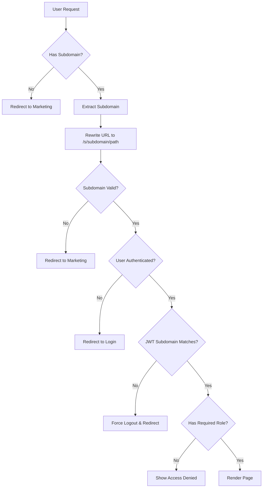
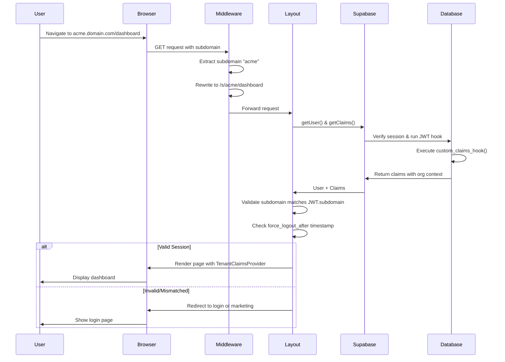
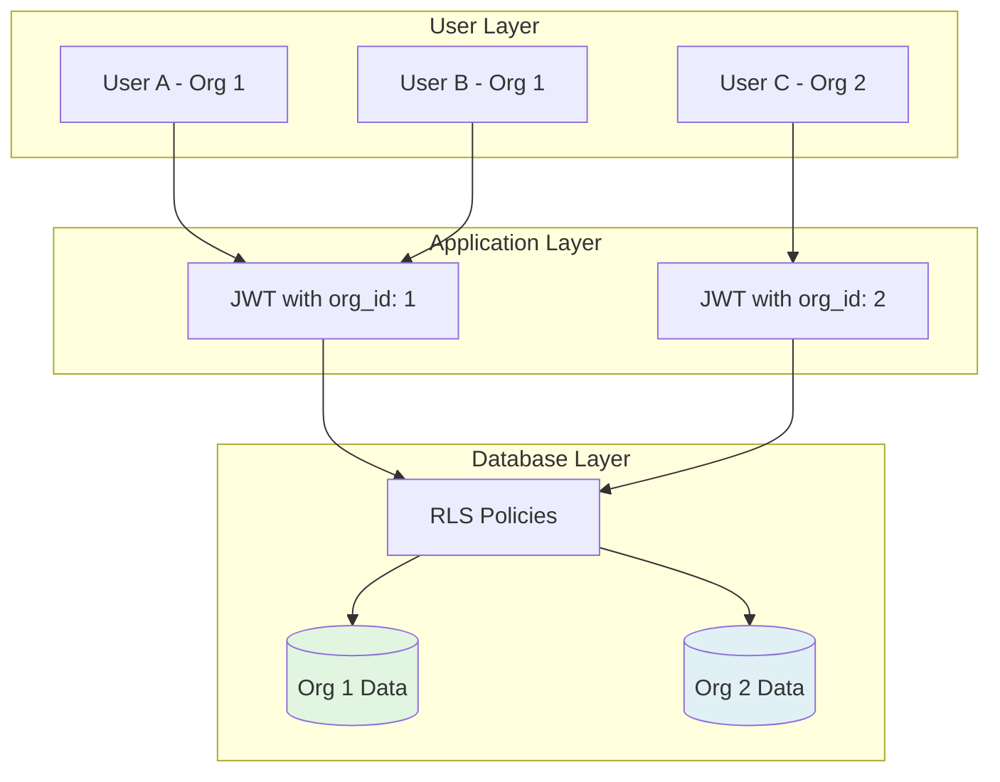
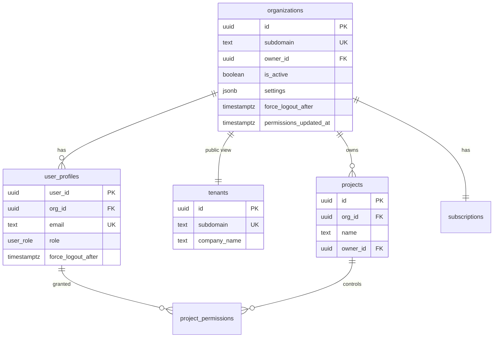
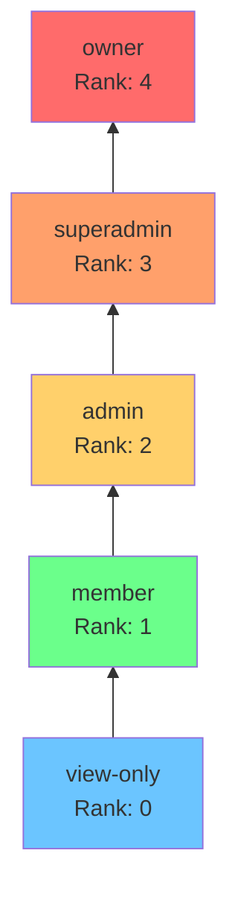
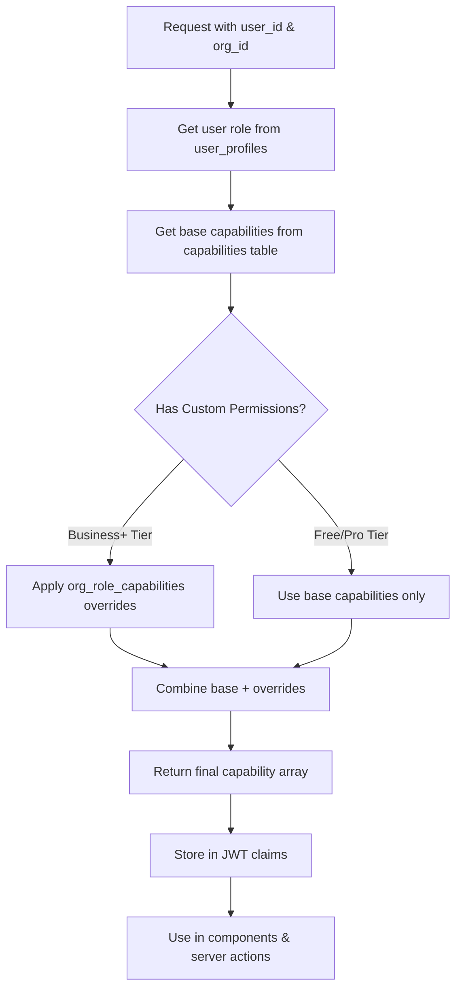
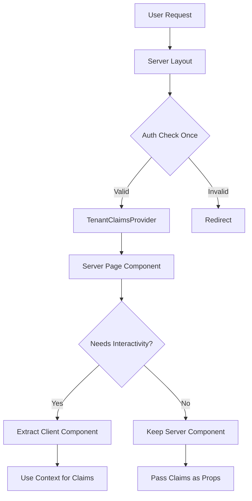
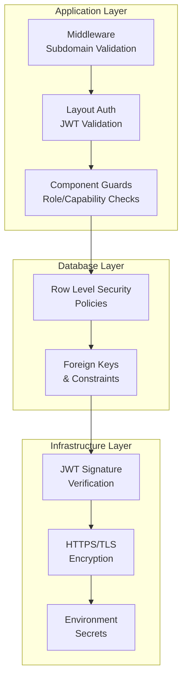

# 🏗️ Architecture Guide

Complete guide to understanding how the multi-tenant SaaS platform works, including subdomain routing, authentication, RBAC, and data isolation.

---

## Table of Contents

- [Overview](#overview)
- [Application Structure](#application-structure)
- [Subdomain Routing](#subdomain-routing)
- [Authentication Flow](#authentication-flow)
- [Multi-Tenant Data Isolation](#multi-tenant-data-isolation)
- [RBAC System](#rbac-system)
- [Component Patterns](#component-patterns)
- [Security Features](#security-features)
- [Key Design Decisions](#key-design-decisions)

---

## Overview

This platform is a **multi-tenant SaaS application** with subdomain-based routing and strict tenant isolation. Each organization gets its own subdomain workspace with role-based access control and subscription-based features.

### Architecture Highlights

- **Subdomain Isolation**: Each tenant has a unique subdomain (e.g., `acme.yourdomain.app`)
- **JWT-Based Auth**: Custom claims in JWT tokens provide tenant context and permissions
- **Row Level Security**: Database-level isolation via Supabase RLS policies
- **RBAC**: 5-tier role hierarchy with 41+ granular capabilities
- **Server-First**: Minimize client-side JavaScript, auth checks at layout level
- **Edge Deployment**: Optimized for Vercel Edge Runtime

---

## Application Structure

The monorepo contains two Next.js applications and shared packages:

```
subdomain-isolated-turborepo/
├── apps/
│   ├── marketing/          # Public marketing site
│   │   ├── app/            # Next.js App Router
│   │   ├── components/     # Marketing components
│   │   └── proxy.ts        # Session refresh middleware
│   │
│   └── protected/          # Multi-tenant workspaces
│       ├── app/
│       │   ├── s/[subdomain]/  # Dynamic subdomain routes
│       │   ├── actions/        # Server actions
│       │   └── api/            # API routes (webhooks)
│       ├── components/         # App components
│       ├── lib/
│       │   ├── rbac/          # RBAC utilities
│       │   ├── contexts/      # React contexts
│       │   └── stripe/        # Stripe integration
│       └── proxy.ts           # Subdomain routing middleware
│
└── packages/
    ├── ui/                 # Shared UI components
    ├── supabase/           # Supabase client/server utilities
    ├── eslint-config/      # Shared ESLint config
    └── typescript-config/  # Shared TypeScript config
```

### Marketing App

**Purpose**: Public-facing site for marketing and tenant discovery

**Routes**:
- `/` - Landing page
- `/login` - Tenant lookup and login redirect
- `/signup` - Organization signup with subdomain selection
- `/auth/*` - Auth callback handlers

**Key Features**:
- Server-side rendered for SEO
- Organization signup with subdomain reservation
- Tenant subdomain lookup
- Redirects to tenant subdomains after auth

### Protected App

**Purpose**: Multi-tenant workspace application

**Routes**:
- `/` - Redirects to marketing site
- `/s/[subdomain]/*` - Internal route structure (rewritten by middleware)
- `/s/[subdomain]/dashboard` - Organization dashboard
- `/s/[subdomain]/settings/*` - Settings pages
- `/s/[subdomain]/projects/*` - Project management

**Key Features**:
- Subdomain-based routing via middleware
- JWT claims validation at layout level
- Role-based access control
- Subscription-based feature gating
- Real-time data with Supabase subscriptions

---

## Subdomain Routing

The platform uses middleware to rewrite subdomain URLs to internal routes, providing clean URLs while maintaining a single application deployment.

### URL Structure

```
User sees:     https://acme.yourdomain.app/dashboard
Middleware rewrites to: /s/acme/dashboard
```

### Routing Flow



### Middleware Implementation

Located in `apps/protected/proxy.ts`:

```typescript
// Simplified version
export async function middleware(request: NextRequest) {
  const hostname = request.headers.get('host') || '';
  const subdomain = extractSubdomain(hostname);
  
  // No subdomain → redirect to marketing
  if (!subdomain) {
    return NextResponse.redirect(marketingUrl);
  }
  
  // Rewrite URL: acme.domain.com/dashboard → /s/acme/dashboard
  const pathname = request.nextUrl.pathname;
  const newUrl = new URL(`/s/${subdomain}${pathname}`, request.url);
  
  return NextResponse.rewrite(newUrl);
}
```

### Subdomain Validation

Subdomain validation happens at the layout level:

**File**: `apps/protected/app/s/[subdomain]/layout.tsx`

1. **Extract subdomain** from route params
2. **Query `tenants` table** to verify subdomain exists
3. **Check organization status** (active vs pending)
4. **Redirect to marketing** if invalid or inactive

---

## Authentication Flow

The platform uses Supabase Auth with custom JWT claims that include organization and role context.

### Authentication Sequence



### JWT Custom Claims

The `custom_claims_hook` function adds tenant context to every JWT token:

**File**: `supabase/schemas/03_functions.sql`

```sql
CREATE OR REPLACE FUNCTION custom_claims_hook(event jsonb)
RETURNS jsonb
LANGUAGE plpgsql
AS $$
BEGIN
  -- Returns claims with:
  -- - user_role: "owner" | "superadmin" | "admin" | "member" | "view-only"
  -- - subdomain: Organization subdomain
  -- - org_id: Organization UUID
  -- - company_name: Organization name
  -- - capabilities: Array of capability keys
  -- - organization_logo_url: Logo URL
END;
$$;
```

### Claims Structure

```typescript
interface TenantClaims {
  user_role: 'owner' | 'superadmin' | 'admin' | 'member' | 'view-only';
  subdomain: string;
  org_id: string;
  company_name: string;
  capabilities: string[];
  organization_logo_url?: string;
}
```

### Session Validation

Every protected page layout validates:

1. **User is authenticated** - `getUser()` returns valid user
2. **Claims exist** - `getClaims()` returns tenant claims
3. **Subdomain matches** - JWT `subdomain` === route `subdomain`
4. **Not force logged out** - Check `should_force_logout()` function

### Force Logout Mechanism

Organizations can force users to re-authenticate when:

- **Permissions are updated** - `organizations.permissions_updated_at`
- **Security event occurs** - `organizations.force_logout_after`
- **User-specific logout** - `user_profiles.force_logout_after`

The system checks if JWT `iat` (issued at) is before any of these timestamps.

---

## Multi-Tenant Data Isolation

Data isolation is enforced through a combination of application logic, JWT claims, and database Row Level Security (RLS) policies.

### Tenant Isolation Architecture



### Core Tables for Multi-Tenancy



### RLS Policy Pattern

All tables with `org_id` use RLS policies that check JWT claims:

```sql
-- Example: Organizations SELECT policy
CREATE POLICY "org_members_select" ON organizations
FOR SELECT
TO authenticated
USING (
  user_org_access(
    auth.uid(),
    id,
    ARRAY['view-only', 'member', 'admin', 'superadmin', 'owner']
  )
);
```

The `user_org_access()` function:
1. Gets user's `org_id` from `user_profiles`
2. Checks if it matches the requested organization
3. Validates user has one of the required roles

### Data Access Flow

1. **User makes request** with JWT token
2. **Application extracts claims** from JWT
3. **Supabase client** includes JWT in database queries
4. **RLS policies evaluate** using `auth.uid()` and custom functions
5. **Only matching data** is returned (filtered by `org_id`)

---

## RBAC System

The platform implements a hierarchical role-based access control system with capability-based permissions.

### Role Hierarchy



**Role Ranks** (higher inherits lower):
- **view-only** (0): Read-only access
- **member** (1): Basic user permissions
- **admin** (2): Team and project management
- **superadmin** (3): Organization-wide management
- **owner** (4): Full control, billing, org deletion

### Capability System

Capabilities are granular permissions in `category.action` format:

**Categories**:
- `projects.*` - Project management
- `team.*` - Team member management
- `org.settings.*` - Organization settings
- `billing.*` - Billing and subscriptions
- `security.*` - Security settings and audit logs
- `analytics.*` - Reports and analytics

**Example Capabilities**:
- `projects.create`
- `projects.delete`
- `team.invite`
- `team.remove`
- `org.settings.edit`
- `billing.manage`
- `security.view_org_audit`

### Permission Resolution Flow



### Database Functions

**Get User Capabilities**:

```sql
SELECT get_user_capabilities(user_id, org_id);
-- Returns: ARRAY['projects.create', 'team.invite', ...]
```

**Check Specific Capability**:

```sql
SELECT user_org_capability(user_id, org_id, 'projects.delete');
-- Returns: true/false
```

**Check Org Access**:

```sql
SELECT user_org_access(user_id, org_id, ARRAY['admin', 'owner']);
-- Returns: true if user has admin or owner role
```

### Custom Permissions (Business+ Feature)

Organizations on Business or Enterprise tiers can customize role capabilities:

1. **Grant additional capabilities** to lower roles
2. **Revoke capabilities** from higher roles
3. **Create custom role configurations** per organization

Stored in `org_role_capabilities` table:

```typescript
{
  org_id: 'uuid',
  role: 'member',
  capability_id: 'uuid',
  granted: true,  // true = grant, false = revoke
  requires_min_tier_id: 'business-tier-uuid'
}
```

### Using RBAC in Components

#### Server Components

```typescript
// Check capability in server component
import { getUserPermissions } from '@/lib/rbac/permissions';

export default async function ProjectPage() {
  const permissions = await getUserPermissions();
  
  if (!permissions.capabilities.includes('projects.create')) {
    return <AccessDenied />;
  }
  
  return <ProjectList />;
}
```

#### Client Components

```typescript
// Use context in client component
'use client';

import { useTenantClaims } from '@/lib/contexts/tenant-claims-context';

export function CreateProjectButton() {
  const claims = useTenantClaims();
  
  if (!claims.capabilities.includes('projects.create')) {
    return null;
  }
  
  return <Button>Create Project</Button>;
}
```

#### Wrapper Components

```typescript
// Capability-based wrapper
import { RequireCapability } from '@/components/shared/require-capability';

export function AdminPanel() {
  return (
    <RequireCapability capability="org.settings.edit">
      <SettingsForm />
    </RequireCapability>
  );
}
```

---

## Component Patterns

The platform follows a server-first architecture with specific patterns for organization and performance.

### Server-First Architecture



### Layout-Level Auth Pattern

**File**: `apps/protected/app/s/[subdomain]/(protected)/layout.tsx`

```typescript
export default async function ProtectedLayout({ children }) {
  // 1. Auth check happens once at layout level
  const { user, claims } = await validateSession();
  
  if (!user || !claims) {
    redirect('/auth/login');
  }
  
  // 2. Validate subdomain matches JWT
  if (claims.subdomain !== params.subdomain) {
    redirect('/auth/logout');
  }
  
  // 3. Check force logout
  if (await shouldForceLogout(user.id, claims.org_id)) {
    redirect('/auth/logout');
  }
  
  // 4. Provide claims via context
  return (
    <TenantClaimsProvider claims={claims}>
      {children}
    </TenantClaimsProvider>
  );
}
```

### Wrapper Component Pattern

Page files are thin; logic lives in wrapper components:

```
pages/settings/page.tsx       (50 lines)
  └─> components/settings/settings-wrapper.tsx  (300 lines)
      ├─> settings-form.tsx
      ├─> settings-tabs.tsx
      └─> actions.ts (server actions)
```

**Benefits**:
- Cleaner page files
- Better code organization
- Easier testing
- Reusable components

### Context Pattern

Use React Context to share JWT claims without prop drilling:

```typescript
// Provider (in layout)
<TenantClaimsProvider claims={claims}>
  {children}
</TenantClaimsProvider>

// Consumer (in any child component)
const claims = useTenantClaims();
```

### Server Action Pattern

Server actions validate claims and subdomain:

```typescript
'use server';

export async function createProject(formData: FormData) {
  // 1. Get authenticated user
  const supabase = await createClient();
  const { data: { user } } = await supabase.auth.getUser();
  
  if (!user) {
    return { success: false, message: 'Unauthorized' };
  }
  
  // 2. Get and validate claims
  const claims = await getClaims();
  
  if (!claims.capabilities.includes('projects.create')) {
    return { success: false, message: 'Insufficient permissions' };
  }
  
  // 3. Perform action (RLS enforces org_id)
  const { data, error } = await supabase
    .from('projects')
    .insert({
      name: formData.get('name'),
      org_id: claims.org_id
    });
    
  // 4. Revalidate cache
  revalidatePath('/projects');
  
  return { success: true, data };
}
```

---

## Security Features

The platform implements defense-in-depth security at multiple layers.

### Security Layers



### Authentication Security

1. **JWT-based sessions** with automatic refresh
2. **Custom claims** for tenant context
3. **Force logout** mechanism for security events
4. **Session timeout** configurable per user
5. **Multi-factor authentication** (2FA) support

### Authorization Security

1. **Role hierarchy** prevents privilege escalation
2. **Capability-based** access control
3. **Server-side validation** of all actions
4. **Client components** use context (no API calls)
5. **RLS policies** at database level

### Data Security

1. **Row Level Security** on all tables
2. **Tenant isolation** via `org_id` filtering
3. **Foreign key constraints** prevent orphaned data
4. **Encrypted fields** for sensitive data
5. **Audit logging** for security events

### API Security

1. **Server actions** instead of API routes where possible
2. **Webhook signature** verification (Stripe)
3. **Rate limiting** on API endpoints
4. **CORS configuration** for external APIs
5. **Service role key** isolated to server

### Infrastructure Security

1. **Environment variables** for secrets
2. **HTTPS/TLS** encryption in transit
3. **Edge runtime** for global performance
4. **DDoS protection** via Vercel
5. **Database encryption** at rest (Supabase)

---

## Key Design Decisions

### Why Subdomain-Based Routing?

**Pros**:
- Clear tenant isolation in URL
- Better branding for customers
- Simplified routing logic
- SEO benefits per tenant

**Cons**:
- Requires wildcard DNS
- Cookie complexity
- SSL certificate management

**Alternative considered**: Path-based (`/org/acme/dashboard`) - rejected due to worse UX

### Why JWT Claims for Permissions?

**Pros**:
- No database query for every auth check
- Claims cached in token
- Works with RLS policies
- Scalable to millions of users

**Cons**:
- Token size increases
- Requires force logout for permission changes
- Claims can be stale

**Alternative considered**: Database lookup on every request - rejected due to performance

### Why Server-First Architecture?

**Pros**:
- Better performance (less client JS)
- Improved SEO
- Easier auth validation
- Reduced bundle size

**Cons**:
- More complex than traditional SPAs
- Requires understanding of RSC

**Alternative considered**: Client-side SPA - rejected due to SEO and performance

### Why Monorepo with Turborepo?

**Pros**:
- Shared code between apps
- Single deployment pipeline
- Easier dependency management
- Better DX with `pnpm dev`

**Cons**:
- More complex setup
- Larger repository

**Alternative considered**: Separate repos - rejected due to code duplication

---

## Next Steps

- **[Database Schema](./DATABASE.md)** - Deep dive into database structure
- **[Getting Started](./GETTING_STARTED.md)** - Set up your development environment
- **[Stripe Integration](./STRIPE.md)** - Add billing to your platform
- **[Deployment Guide](./VERCEL_DEPLOYMENT.md)** - Deploy to production

---

**Questions?** Check the [troubleshooting guide](./GETTING_STARTED.md#troubleshooting) or [open a discussion](https://github.com/your-repo/discussions).
