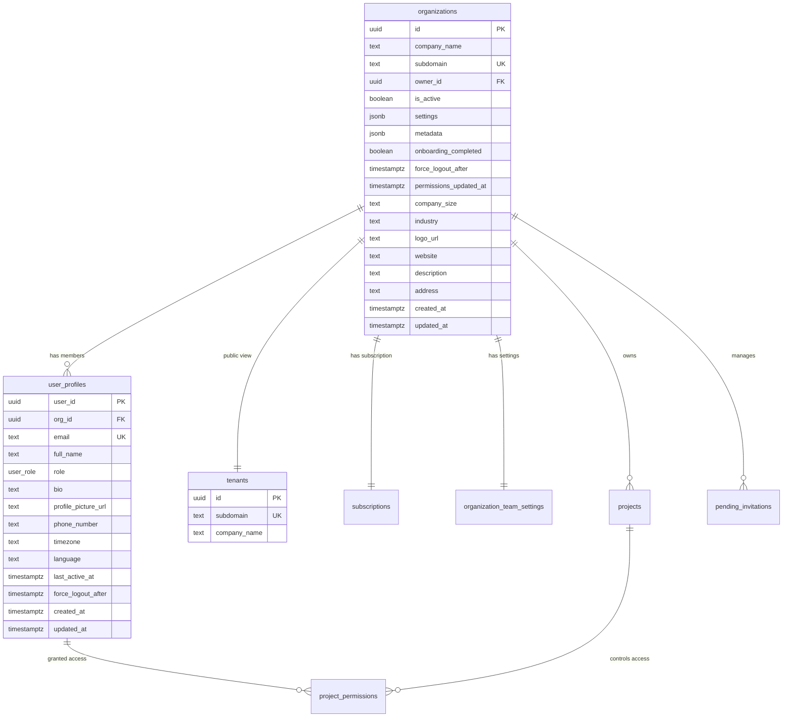
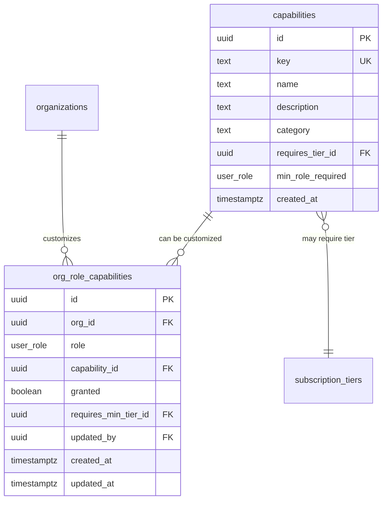
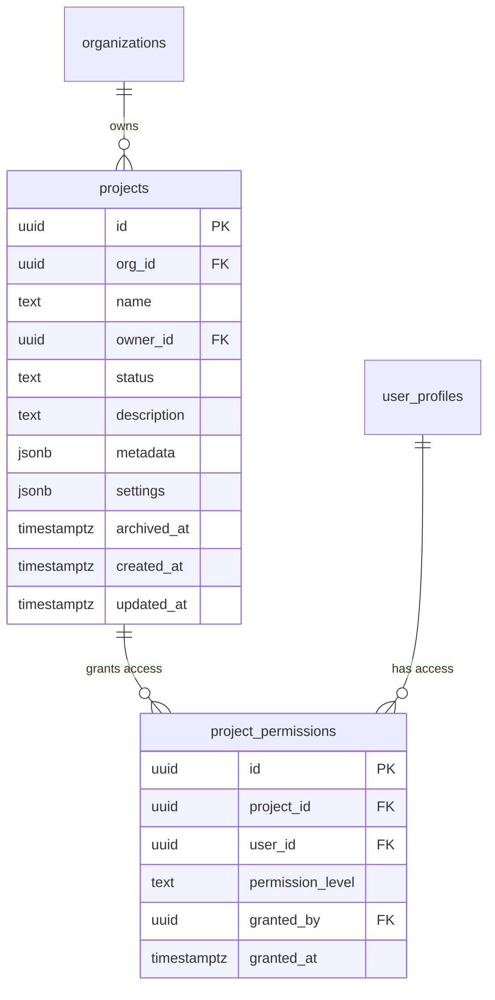

# 🗄️ Database Schema Reference

Complete reference for the multi-tenant SaaS database schema built on Supabase (PostgreSQL).

---

## Table of Contents

- [Schema Overview](#schema-overview)
- [Core Tables](#core-tables)
- [RBAC Tables](#rbac-tables)
- [Subscription & Billing Tables](#subscription--billing-tables)
- [Project Management Tables](#project-management-tables)
- [Team Management Tables](#team-management-tables)
- [Security Tables](#security-tables)
- [Database Functions](#database-functions)
- [Database Views](#database-views)
- [Row Level Security Policies](#row-level-security-policies)
- [Triggers](#triggers)
- [Storage Buckets](#storage-buckets)

---

## Schema Overview

### Extensions

The schema uses the following PostgreSQL extensions:

```sql
-- Scheduled jobs (cron tasks)
CREATE EXTENSION IF NOT EXISTS pg_cron;

-- Encryption functions
CREATE EXTENSION IF NOT EXISTS pgcrypto;

-- UUID generation
CREATE EXTENSION IF NOT EXISTS "uuid-ossp";

-- Vector operations (for AI features)
CREATE EXTENSION IF NOT EXISTS vector;

-- Text search (fuzzy matching)
CREATE EXTENSION IF NOT EXISTS pg_trgm;

-- Query statistics
CREATE EXTENSION IF NOT EXISTS pg_stat_statements;
```

### Enums and Types

```sql
-- Invitation status
CREATE TYPE invitation_status AS ENUM (
  'pending',
  'approved',
  'rejected',
  'expired'
);

-- Project permission levels
CREATE TYPE project_permission_level AS ENUM (
  'read',
  'write',
  'admin'
);

-- Project status
CREATE TYPE project_status AS ENUM (
  'active',
  'archived',
  'deleted'
);

-- User roles (with numeric ranks)
CREATE TYPE user_role AS ENUM (
  'view-only',    -- Rank: 0
  'member',       -- Rank: 1
  'admin',        -- Rank: 2
  'superadmin',   -- Rank: 3
  'owner'         -- Rank: 4
);
```

---

## Core Tables

These tables form the foundation of the multi-tenant architecture.

### Entity Relationship Diagram



### organizations

Multi-tenant root table. Each row represents a company/organization.

```sql
CREATE TABLE organizations (
  id UUID PRIMARY KEY DEFAULT uuid_generate_v4(),
  company_name TEXT NOT NULL,
  subdomain TEXT UNIQUE NOT NULL,
  owner_id UUID REFERENCES auth.users(id) ON DELETE SET NULL,
  is_active BOOLEAN DEFAULT false,
  settings JSONB DEFAULT '{}'::jsonb,
  metadata JSONB DEFAULT '{}'::jsonb,
  onboarding_completed BOOLEAN DEFAULT false,
  force_logout_after TIMESTAMPTZ,
  permissions_updated_at TIMESTAMPTZ,
  company_size TEXT CHECK (company_size IN ('1-10', '11-50', '51-200', '201-500', '501+')),
  industry TEXT,
  logo_url TEXT,
  website TEXT,
  description TEXT,
  address TEXT,
  created_at TIMESTAMPTZ DEFAULT NOW(),
  updated_at TIMESTAMPTZ DEFAULT NOW()
);
```

**Key Columns**:
- `subdomain`: Unique identifier for tenant routing
- `is_active`: Organization must be activated after email verification
- `force_logout_after`: Timestamp for organization-wide logout
- `permissions_updated_at`: Triggers force logout when permissions change
- `onboarding_completed`: Tracks onboarding flow completion

**Indexes**:
```sql
CREATE INDEX idx_organizations_subdomain ON organizations(subdomain);
CREATE INDEX idx_organizations_owner_id ON organizations(owner_id);
CREATE INDEX idx_organizations_is_active ON organizations(is_active);
```

### tenants

Public-facing view for tenant lookup. No RLS policies (public).

```sql
CREATE TABLE tenants (
  id UUID PRIMARY KEY REFERENCES organizations(id) ON DELETE CASCADE,
  subdomain TEXT UNIQUE NOT NULL REFERENCES organizations(subdomain) ON DELETE CASCADE,
  company_name TEXT NOT NULL
);
```

**Purpose**: Allows anonymous users to look up tenant subdomains for login.

### user_profiles

Extended user information with organization membership.

```sql
CREATE TABLE user_profiles (
  user_id UUID PRIMARY KEY REFERENCES auth.users(id) ON DELETE CASCADE,
  org_id UUID REFERENCES organizations(id) ON DELETE CASCADE,
  email TEXT UNIQUE NOT NULL,
  full_name TEXT,
  role user_role DEFAULT 'member',
  bio TEXT,
  profile_picture_url TEXT,
  phone_number TEXT,
  timezone TEXT DEFAULT 'UTC',
  language TEXT DEFAULT 'en',
  last_active_at TIMESTAMPTZ,
  force_logout_after TIMESTAMPTZ,
  created_at TIMESTAMPTZ DEFAULT NOW(),
  updated_at TIMESTAMPTZ DEFAULT NOW()
);
```

**Key Columns**:
- `org_id`: Links user to organization (one user = one org)
- `role`: User's role in the organization
- `force_logout_after`: User-specific logout timestamp
- `last_active_at`: Track user activity

**Indexes**:
```sql
CREATE INDEX idx_user_profiles_org_id ON user_profiles(org_id);
CREATE INDEX idx_user_profiles_email ON user_profiles(email);
```

---

## RBAC Tables

Role-Based Access Control with capability-based permissions.

### RBAC Entity Relationship



### capabilities

Defines all available permissions in the system.

```sql
CREATE TABLE capabilities (
  id UUID PRIMARY KEY DEFAULT uuid_generate_v4(),
  key TEXT UNIQUE NOT NULL,  -- Format: 'category.action'
  name TEXT NOT NULL,
  description TEXT,
  category TEXT NOT NULL,
  requires_tier_id UUID REFERENCES subscription_tiers(id),
  min_role_required user_role DEFAULT 'member',
  created_at TIMESTAMPTZ DEFAULT NOW()
);
```

**Key Format**: `category.action`

**Categories**:
- `projects.*` - Project management
- `team.*` - Team member management
- `org.settings.*` - Organization settings
- `billing.*` - Billing and subscriptions
- `security.*` - Security settings
- `analytics.*` - Reports and analytics
- `profile.*` - Profile management
- `notifications.*` - Notification preferences

**Example Capabilities**:
```sql
INSERT INTO capabilities (key, name, category, min_role_required) VALUES
  ('projects.create', 'Create Projects', 'projects', 'member'),
  ('projects.delete', 'Delete Projects', 'projects', 'admin'),
  ('team.invite', 'Invite Team Members', 'team', 'admin'),
  ('team.remove', 'Remove Team Members', 'team', 'admin'),
  ('org.settings.edit', 'Edit Organization Settings', 'organization', 'superadmin'),
  ('billing.manage', 'Manage Billing', 'billing', 'owner'),
  ('security.view_org_audit', 'View Audit Logs', 'security', 'admin');
```

### org_role_capabilities

Organization-specific capability overrides (Business+ feature).

```sql
CREATE TABLE org_role_capabilities (
  id UUID PRIMARY KEY DEFAULT uuid_generate_v4(),
  org_id UUID NOT NULL REFERENCES organizations(id) ON DELETE CASCADE,
  role user_role NOT NULL,
  capability_id UUID NOT NULL REFERENCES capabilities(id) ON DELETE CASCADE,
  granted BOOLEAN NOT NULL,  -- true = grant, false = revoke
  requires_min_tier_id UUID REFERENCES subscription_tiers(id),
  updated_by UUID REFERENCES auth.users(id),
  created_at TIMESTAMPTZ DEFAULT NOW(),
  updated_at TIMESTAMPTZ DEFAULT NOW(),
  UNIQUE(org_id, role, capability_id)
);
```

**How it works**:
1. **Base permissions**: From `capabilities.min_role_required`
2. **Custom grants**: `granted = true` adds capability to role
3. **Custom revokes**: `granted = false` removes capability from role
4. **Tier requirement**: Only Business+ can customize

**Indexes**:
```sql
CREATE INDEX idx_org_role_caps_org_id ON org_role_capabilities(org_id);
CREATE INDEX idx_org_role_caps_role ON org_role_capabilities(role);
```

---

## Subscription & Billing Tables

Stripe integration for subscription management and usage tracking.

### Billing Entity Relationship

```mermaid
erDiagram
    subscription_tiers ||--o{ subscriptions : "tier type"
    subscription_tiers ||--o{ feature_limits : "defines limits"
    organizations ||--|| subscriptions : "has active"
    organizations ||--|| customer_billing_profiles : "billing info"
    organizations ||--o{ payment_methods : "saved cards"
    organizations ||--o{ invoices : "billing history"
    organizations ||--o{ usage_metrics : "tracks usage"
    organizations ||--o{ usage_counters : "time-windowed"
    subscriptions ||--o{ invoices : "generates"
    
    subscription_tiers {
        uuid id PK
        text name UK
        boolean allows_custom_permissions
        integer max_projects
        integer max_team_members
        text stripe_product_id
        text stripe_price_id
        integer price_monthly
        integer price_yearly
        timestamptz created_at
    }
    
    subscriptions {
        uuid id PK
        uuid org_id FK_UK
        uuid tier_id FK
        text status
        text stripe_subscription_id UK
        text billing_cycle
        timestamptz current_period_start
        timestamptz current_period_end
        boolean cancel_at_period_end
        timestamptz trial_end
        timestamptz created_at
        timestamptz updated_at
    }
    
    feature_limits {
        uuid id PK
        uuid tier_id FK
        text feature_key
        integer limit_per_period
    }
```

### subscription_tiers

Defines subscription plans.

```sql
CREATE TABLE subscription_tiers (
  id UUID PRIMARY KEY DEFAULT uuid_generate_v4(),
  name TEXT UNIQUE NOT NULL,  -- 'free', 'pro', 'business', 'enterprise'
  allows_custom_permissions BOOLEAN DEFAULT false,
  max_projects INTEGER,
  max_team_members INTEGER,
  stripe_product_id TEXT,
  stripe_price_id TEXT,
  price_monthly INTEGER,  -- In cents
  price_yearly INTEGER,   -- In cents
  created_at TIMESTAMPTZ DEFAULT NOW()
);
```

**Default Tiers**:
```sql
INSERT INTO subscription_tiers (name, max_projects, max_team_members, allows_custom_permissions) VALUES
  ('free', 3, 5, false),
  ('pro', 25, 25, false),
  ('business', 100, 100, true),
  ('enterprise', NULL, NULL, true);  -- NULL = unlimited
```

### subscriptions

Active subscriptions per organization.

```sql
CREATE TABLE subscriptions (
  id UUID PRIMARY KEY DEFAULT uuid_generate_v4(),
  org_id UUID UNIQUE NOT NULL REFERENCES organizations(id) ON DELETE CASCADE,
  tier_id UUID NOT NULL REFERENCES subscription_tiers(id),
  status TEXT NOT NULL CHECK (status IN (
    'active', 'trialing', 'past_due', 'canceled', 
    'unpaid', 'incomplete', 'incomplete_expired'
  )),
  stripe_subscription_id TEXT UNIQUE,
  billing_cycle TEXT CHECK (billing_cycle IN ('monthly', 'yearly')),
  current_period_start TIMESTAMPTZ,
  current_period_end TIMESTAMPTZ,
  cancel_at_period_end BOOLEAN DEFAULT false,
  trial_end TIMESTAMPTZ,
  created_at TIMESTAMPTZ DEFAULT NOW(),
  updated_at TIMESTAMPTZ DEFAULT NOW()
);
```

### feature_limits

Per-tier feature limits.

```sql
CREATE TABLE feature_limits (
  id UUID PRIMARY KEY DEFAULT uuid_generate_v4(),
  tier_id UUID NOT NULL REFERENCES subscription_tiers(id) ON DELETE CASCADE,
  feature_key TEXT NOT NULL,
  limit_per_period INTEGER,  -- NULL = unlimited
  UNIQUE(tier_id, feature_key)
);
```

**Example Limits**:
```sql
INSERT INTO feature_limits (tier_id, feature_key, limit_per_period) VALUES
  ((SELECT id FROM subscription_tiers WHERE name = 'free'), 'api_calls', 10000),
  ((SELECT id FROM subscription_tiers WHERE name = 'free'), 'storage_gb', 5),
  ((SELECT id FROM subscription_tiers WHERE name = 'pro'), 'api_calls', 100000),
  ((SELECT id FROM subscription_tiers WHERE name = 'pro'), 'storage_gb', 50);
```

### customer_billing_profiles

Stripe customer information.

```sql
CREATE TABLE customer_billing_profiles (
  id UUID PRIMARY KEY DEFAULT uuid_generate_v4(),
  org_id UUID UNIQUE NOT NULL REFERENCES organizations(id) ON DELETE CASCADE,
  stripe_customer_id TEXT UNIQUE NOT NULL,
  billing_email TEXT,
  billing_name TEXT,
  billing_address JSONB,
  default_payment_method_id TEXT,
  created_at TIMESTAMPTZ DEFAULT NOW(),
  updated_at TIMESTAMPTZ DEFAULT NOW()
);
```

### payment_methods

Saved payment methods.

```sql
CREATE TABLE payment_methods (
  id UUID PRIMARY KEY DEFAULT uuid_generate_v4(),
  org_id UUID NOT NULL REFERENCES organizations(id) ON DELETE CASCADE,
  stripe_payment_method_id TEXT UNIQUE NOT NULL,
  type TEXT CHECK (type IN ('card', 'bank_account', 'sepa_debit')),
  card_brand TEXT,
  card_last4 TEXT,
  card_exp_month INTEGER,
  card_exp_year INTEGER,
  is_default BOOLEAN DEFAULT false,
  created_at TIMESTAMPTZ DEFAULT NOW()
);
```

### invoices

Billing history.

```sql
CREATE TABLE invoices (
  id UUID PRIMARY KEY DEFAULT uuid_generate_v4(),
  org_id UUID NOT NULL REFERENCES organizations(id) ON DELETE CASCADE,
  subscription_id UUID REFERENCES subscriptions(id),
  stripe_invoice_id TEXT UNIQUE NOT NULL,
  status TEXT CHECK (status IN ('draft', 'open', 'paid', 'void', 'uncollectible')),
  amount_due INTEGER,      -- In cents
  amount_paid INTEGER,     -- In cents
  amount_remaining INTEGER,-- In cents
  invoice_pdf TEXT,
  hosted_invoice_url TEXT,
  due_date TIMESTAMPTZ,
  paid_at TIMESTAMPTZ,
  created_at TIMESTAMPTZ DEFAULT NOW()
);
```

### usage_metrics

Organization-level usage tracking.

```sql
CREATE TABLE usage_metrics (
  id UUID PRIMARY KEY DEFAULT uuid_generate_v4(),
  org_id UUID NOT NULL REFERENCES organizations(id) ON DELETE CASCADE,
  metric_name TEXT NOT NULL,
  current_value INTEGER DEFAULT 0,
  limit_value INTEGER,  -- NULL = unlimited
  period_start TIMESTAMPTZ DEFAULT NOW(),
  period_end TIMESTAMPTZ,
  updated_at TIMESTAMPTZ DEFAULT NOW(),
  UNIQUE(org_id, metric_name, period_start)
);
```

**Default Metrics**:
- `team_members`: Current count vs limit
- `projects`: Active projects vs limit
- `storage_gb`: Storage used vs limit
- `api_calls`: Calls this period vs limit

### usage_counters

Time-windowed feature usage (monthly windows).

```sql
CREATE TABLE usage_counters (
  org_id UUID NOT NULL REFERENCES organizations(id) ON DELETE CASCADE,
  feature_key TEXT NOT NULL,
  window_start TIMESTAMPTZ NOT NULL,
  count INTEGER DEFAULT 0,
  updated_at TIMESTAMPTZ DEFAULT NOW(),
  PRIMARY KEY (org_id, feature_key, window_start)
);
```

---

## Project Management Tables



### projects

```sql
CREATE TABLE projects (
  id UUID PRIMARY KEY DEFAULT uuid_generate_v4(),
  org_id UUID NOT NULL REFERENCES organizations(id) ON DELETE CASCADE,
  name TEXT NOT NULL,
  owner_id UUID NOT NULL REFERENCES auth.users(id),
  status project_status DEFAULT 'active',
  description TEXT,
  metadata JSONB DEFAULT '{}'::jsonb,
  settings JSONB DEFAULT '{}'::jsonb,
  archived_at TIMESTAMPTZ,
  created_at TIMESTAMPTZ DEFAULT NOW(),
  updated_at TIMESTAMPTZ DEFAULT NOW(),
  UNIQUE(org_id, name)
);
```

### project_permissions

```sql
CREATE TABLE project_permissions (
  id UUID PRIMARY KEY DEFAULT uuid_generate_v4(),
  project_id UUID NOT NULL REFERENCES projects(id) ON DELETE CASCADE,
  user_id UUID NOT NULL REFERENCES auth.users(id) ON DELETE CASCADE,
  permission_level project_permission_level NOT NULL,
  granted_by UUID REFERENCES auth.users(id),
  granted_at TIMESTAMPTZ DEFAULT NOW(),
  UNIQUE(project_id, user_id)
);
```

**Permission Levels**:
- `read`: View project and data
- `write`: Edit project data
- `admin`: Manage permissions and delete

---

## Team Management Tables

```mermaid
erDiagram
    organizations ||--|| organization_team_settings : "has config"
    organizations ||--o{ pending_invitations : "sends"
    
    organization_team_settings {
        uuid id PK
        uuid org_id FK_UK
        integer max_team_size
        boolean allow_member_invites
        boolean require_admin_approval
        user_role auto_assign_default_role
        boolean allow_guest_access
        integer guest_link_expiry_days
        timestamptz created_at
        timestamptz updated_at
    }
    
    pending_invitations {
        uuid id PK
        uuid org_id FK
        text email
        user_role proposed_role
        uuid invited_by FK
        text status
        text invitation_token UK
        uuid approved_by FK
        uuid rejected_by FK
        timestamptz approved_at
        timestamptz rejected_at
        text rejection_reason
        timestamptz expires_at
        timestamptz created_at
    }
```

### organization_team_settings

```sql
CREATE TABLE organization_team_settings (
  id UUID PRIMARY KEY DEFAULT uuid_generate_v4(),
  org_id UUID UNIQUE NOT NULL REFERENCES organizations(id) ON DELETE CASCADE,
  max_team_size INTEGER,
  allow_member_invites BOOLEAN DEFAULT false,
  require_admin_approval BOOLEAN DEFAULT false,
  auto_assign_default_role user_role DEFAULT 'member',
  allow_guest_access BOOLEAN DEFAULT false,
  guest_link_expiry_days INTEGER DEFAULT 30,
  created_at TIMESTAMPTZ DEFAULT NOW(),
  updated_at TIMESTAMPTZ DEFAULT NOW()
);
```

**Auto-synced from subscription tier** when subscription changes.

### pending_invitations

```sql
CREATE TABLE pending_invitations (
  id UUID PRIMARY KEY DEFAULT uuid_generate_v4(),
  org_id UUID NOT NULL REFERENCES organizations(id) ON DELETE CASCADE,
  email TEXT NOT NULL,
  proposed_role user_role NOT NULL,
  invited_by UUID NOT NULL REFERENCES auth.users(id),
  status invitation_status DEFAULT 'pending',
  invitation_token TEXT UNIQUE NOT NULL,
  approved_by UUID REFERENCES auth.users(id),
  rejected_by UUID REFERENCES auth.users(id),
  approved_at TIMESTAMPTZ,
  rejected_at TIMESTAMPTZ,
  rejection_reason TEXT,
  expires_at TIMESTAMPTZ DEFAULT (NOW() + INTERVAL '7 days'),
  created_at TIMESTAMPTZ DEFAULT NOW(),
  UNIQUE(org_id, email, status)
);
```

---

## Security Tables

```mermaid
erDiagram
    user_profiles ||--|| user_security_settings : "has config"
    user_profiles ||--|| user_notification_preferences : "preferences"
    organizations ||--o{ security_audit_log : "tracks events"
    
    security_audit_log {
        uuid id PK
        uuid user_id FK
        uuid org_id FK
        text event_type
        text event_action
        jsonb event_metadata
        inet ip_address
        text user_agent
        jsonb location_data
        text severity
        timestamptz created_at
    }
    
    user_security_settings {
        uuid id PK
        uuid user_id FK_UK
        boolean mfa_enabled
        text mfa_factor_id
        timestamptz mfa_enrolled_at
        timestamptz password_changed_at
        boolean require_password_change
        boolean login_notifications
        boolean unusual_activity_alerts
        integer max_active_sessions
        integer session_timeout_minutes
        timestamptz created_at
        timestamptz updated_at
    }
```

### security_audit_log

```sql
CREATE TABLE security_audit_log (
  id UUID PRIMARY KEY DEFAULT uuid_generate_v4(),
  user_id UUID REFERENCES auth.users(id),
  org_id UUID REFERENCES organizations(id),
  event_type TEXT NOT NULL,
  event_action TEXT NOT NULL,
  event_metadata JSONB DEFAULT '{}'::jsonb,
  ip_address INET,
  user_agent TEXT,
  location_data JSONB,
  severity TEXT CHECK (severity IN ('info', 'warning', 'critical')),
  created_at TIMESTAMPTZ DEFAULT NOW()
);
```

**Event Types**:
- `auth`: Login, logout, password changes
- `team`: Member invites, removals, role changes
- `project`: Project access changes
- `billing`: Subscription changes
- `security`: 2FA enrollment, force logout

### user_security_settings

```sql
CREATE TABLE user_security_settings (
  id UUID PRIMARY KEY DEFAULT uuid_generate_v4(),
  user_id UUID UNIQUE NOT NULL REFERENCES auth.users(id) ON DELETE CASCADE,
  mfa_enabled BOOLEAN DEFAULT false,
  mfa_factor_id TEXT,
  mfa_enrolled_at TIMESTAMPTZ,
  password_changed_at TIMESTAMPTZ,
  require_password_change BOOLEAN DEFAULT false,
  login_notifications BOOLEAN DEFAULT true,
  unusual_activity_alerts BOOLEAN DEFAULT true,
  max_active_sessions INTEGER DEFAULT 5,
  session_timeout_minutes INTEGER DEFAULT 10080,  -- 7 days
  created_at TIMESTAMPTZ DEFAULT NOW(),
  updated_at TIMESTAMPTZ DEFAULT NOW()
);
```

### user_notification_preferences

```sql
CREATE TABLE user_notification_preferences (
  id UUID PRIMARY KEY DEFAULT uuid_generate_v4(),
  user_id UUID UNIQUE NOT NULL REFERENCES auth.users(id) ON DELETE CASCADE,
  email_account_activity BOOLEAN DEFAULT true,
  email_team_updates BOOLEAN DEFAULT true,
  email_project_activity BOOLEAN DEFAULT true,
  email_marketing BOOLEAN DEFAULT false,
  inapp_push_enabled BOOLEAN DEFAULT true,
  inapp_sound_enabled BOOLEAN DEFAULT true,
  email_digest_frequency TEXT DEFAULT 'daily' CHECK (
    email_digest_frequency IN ('realtime', 'daily', 'weekly', 'never')
  ),
  quiet_hours_enabled BOOLEAN DEFAULT false,
  quiet_hours_start TIME,
  quiet_hours_end TIME,
  quiet_hours_timezone TEXT DEFAULT 'UTC',
  created_at TIMESTAMPTZ DEFAULT NOW(),
  updated_at TIMESTAMPTZ DEFAULT NOW()
);
```

---

## Database Functions

### User & Organization Management

#### bootstrap_organization

Activates an organization after email verification.

```sql
CREATE OR REPLACE FUNCTION bootstrap_organization(
  p_user_id UUID,
  p_subdomain TEXT
) RETURNS VOID
LANGUAGE plpgsql
SECURITY DEFINER
AS $$
BEGIN
  -- Activate organization
  UPDATE organizations
  SET is_active = true
  WHERE subdomain = p_subdomain AND owner_id = p_user_id;
  
  -- Confirm subdomain reservation
  UPDATE subdomain_reservations
  SET confirmed_at = NOW()
  WHERE subdomain = p_subdomain AND user_id = p_user_id;
END;
$$;
```

#### create_new_organization

Trigger function to create inactive org on signup.

```sql
CREATE OR REPLACE FUNCTION create_new_organization()
RETURNS TRIGGER
LANGUAGE plpgsql
SECURITY DEFINER
AS $$
BEGIN
  IF NEW.raw_user_meta_data->>'organization_name' IS NOT NULL THEN
    INSERT INTO organizations (
      company_name,
      subdomain,
      owner_id,
      is_active
    ) VALUES (
      NEW.raw_user_meta_data->>'organization_name',
      NEW.raw_user_meta_data->>'subdomain',
      NEW.id,
      false  -- Inactive until verified
    );
  END IF;
  RETURN NEW;
END;
$$;
```

### RBAC Functions

#### get_user_capabilities

Returns array of capability keys for a user.

```sql
CREATE OR REPLACE FUNCTION get_user_capabilities(
  p_user_id UUID,
  p_org_id UUID
) RETURNS TEXT[]
LANGUAGE plpgsql
SECURITY DEFINER
AS $$
DECLARE
  v_user_role user_role;
  v_capabilities TEXT[];
  v_allows_custom BOOLEAN;
BEGIN
  -- Get user role
  SELECT role INTO v_user_role
  FROM user_profiles
  WHERE user_id = p_user_id AND org_id = p_org_id;
  
  -- Check if org allows custom permissions
  SELECT st.allows_custom_permissions INTO v_allows_custom
  FROM subscriptions s
  JOIN subscription_tiers st ON st.id = s.tier_id
  WHERE s.org_id = p_org_id;
  
  -- Get base capabilities
  SELECT ARRAY_AGG(c.key) INTO v_capabilities
  FROM capabilities c
  WHERE get_role_rank(c.min_role_required) <= get_role_rank(v_user_role);
  
  -- Apply custom overrides if Business+
  IF v_allows_custom THEN
    -- Add granted capabilities
    -- Remove revoked capabilities
    -- (detailed logic in actual function)
  END IF;
  
  RETURN v_capabilities;
END;
$$;
```

#### user_org_capability

Checks if user has a specific capability.

```sql
CREATE OR REPLACE FUNCTION user_org_capability(
  p_user_id UUID,
  p_org_id UUID,
  p_capability_key TEXT
) RETURNS BOOLEAN
LANGUAGE plpgsql
SECURITY DEFINER
AS $$
BEGIN
  RETURN p_capability_key = ANY(get_user_capabilities(p_user_id, p_org_id));
END;
$$;
```

#### get_role_rank

Returns numeric rank for role comparison.

```sql
CREATE OR REPLACE FUNCTION get_role_rank(p_role user_role)
RETURNS INTEGER
LANGUAGE plpgsql
IMMUTABLE
AS $$
BEGIN
  RETURN CASE p_role
    WHEN 'view-only' THEN 0
    WHEN 'member' THEN 1
    WHEN 'admin' THEN 2
    WHEN 'superadmin' THEN 3
    WHEN 'owner' THEN 4
  END;
END;
$$;
```

### Subscription & Usage Functions

#### get_org_tier

Returns subscription tier info for an organization.

```sql
CREATE OR REPLACE FUNCTION get_org_tier(p_org_id UUID)
RETURNS TABLE (
  tier_name TEXT,
  allows_custom_permissions BOOLEAN,
  max_projects INTEGER,
  max_team_members INTEGER,
  status TEXT
)
LANGUAGE plpgsql
SECURITY DEFINER
AS $$
BEGIN
  RETURN QUERY
  SELECT 
    st.name,
    st.allows_custom_permissions,
    st.max_projects,
    st.max_team_members,
    s.status
  FROM subscriptions s
  JOIN subscription_tiers st ON st.id = s.tier_id
  WHERE s.org_id = p_org_id;
END;
$$;
```

#### check_usage_limit

Checks if organization is within usage limit.

```sql
CREATE OR REPLACE FUNCTION check_usage_limit(
  p_org_id UUID,
  p_metric_name TEXT
) RETURNS BOOLEAN
LANGUAGE plpgsql
AS $$
DECLARE
  v_current INTEGER;
  v_limit INTEGER;
BEGIN
  SELECT current_value, limit_value
  INTO v_current, v_limit
  FROM usage_metrics
  WHERE org_id = p_org_id AND metric_name = p_metric_name;
  
  -- NULL limit = unlimited
  IF v_limit IS NULL THEN
    RETURN true;
  END IF;
  
  RETURN v_current < v_limit;
END;
$$;
```

#### feature_increment_if_within_limit

Atomically increments usage if within limit.

```sql
CREATE OR REPLACE FUNCTION feature_increment_if_within_limit(
  p_org_id UUID,
  p_feature_key TEXT
) RETURNS TABLE (allowed BOOLEAN, remaining INTEGER)
LANGUAGE plpgsql
AS $$
DECLARE
  v_limit INTEGER;
  v_count INTEGER;
  v_window_start TIMESTAMPTZ;
BEGIN
  v_window_start := date_trunc('month', NOW());
  
  -- Get limit from subscription
  SELECT fl.limit_per_period INTO v_limit
  FROM subscriptions s
  JOIN feature_limits fl ON fl.tier_id = s.tier_id
  WHERE s.org_id = p_org_id AND fl.feature_key = p_feature_key;
  
  -- Lock row for update
  SELECT count INTO v_count
  FROM usage_counters
  WHERE org_id = p_org_id 
    AND feature_key = p_feature_key 
    AND window_start = v_window_start
  FOR UPDATE;
  
  -- Check limit
  IF v_limit IS NOT NULL AND v_count >= v_limit THEN
    RETURN QUERY SELECT false, 0;
    RETURN;
  END IF;
  
  -- Increment
  UPDATE usage_counters
  SET count = count + 1, updated_at = NOW()
  WHERE org_id = p_org_id 
    AND feature_key = p_feature_key 
    AND window_start = v_window_start;
  
  RETURN QUERY SELECT true, v_limit - v_count - 1;
END;
$$;
```

### Security Functions

#### should_force_logout

Checks if user should be forced to logout.

```sql
CREATE OR REPLACE FUNCTION should_force_logout(
  p_user_id UUID,
  p_org_id UUID,
  p_jwt_issued_at TIMESTAMPTZ
) RETURNS BOOLEAN
LANGUAGE plpgsql
SECURITY DEFINER
AS $$
DECLARE
  v_org_logout TIMESTAMPTZ;
  v_user_logout TIMESTAMPTZ;
  v_perms_updated TIMESTAMPTZ;
BEGIN
  -- Get logout timestamps
  SELECT force_logout_after, permissions_updated_at
  INTO v_org_logout, v_perms_updated
  FROM organizations
  WHERE id = p_org_id;
  
  SELECT force_logout_after
  INTO v_user_logout
  FROM user_profiles
  WHERE user_id = p_user_id AND org_id = p_org_id;
  
  -- Check if JWT is older than any logout timestamp
  IF v_org_logout IS NOT NULL AND p_jwt_issued_at < v_org_logout THEN
    RETURN true;
  END IF;
  
  IF v_user_logout IS NOT NULL AND p_jwt_issued_at < v_user_logout THEN
    RETURN true;
  END IF;
  
  IF v_perms_updated IS NOT NULL AND p_jwt_issued_at < v_perms_updated THEN
    RETURN true;
  END IF;
  
  RETURN false;
END;
$$;
```

### JWT Claims Hook

#### custom_claims_hook

Adds organization context to JWT tokens (called by Supabase Auth).

```sql
CREATE OR REPLACE FUNCTION custom_claims_hook(event JSONB)
RETURNS JSONB
LANGUAGE plpgsql
SECURITY DEFINER
AS $$
DECLARE
  v_claims JSONB;
  v_user_id UUID;
BEGIN
  v_user_id := (event->>'user_id')::UUID;
  
  -- Build claims from user_profiles and capabilities
  SELECT jsonb_build_object(
    'user_role', up.role,
    'subdomain', o.subdomain,
    'org_id', o.id,
    'company_name', o.company_name,
    'capabilities', get_user_capabilities(v_user_id, o.id),
    'organization_logo_url', o.logo_url
  ) INTO v_claims
  FROM user_profiles up
  JOIN organizations o ON o.id = up.org_id
  WHERE up.user_id = v_user_id;
  
  RETURN jsonb_set(event, '{claims}', v_claims);
END;
$$;
```

---

## Database Views

### org_entitlements

Resolves active subscription features for an organization.

```sql
CREATE VIEW org_entitlements AS
SELECT 
  s.org_id,
  fl.feature_key,
  fl.limit_per_period
FROM subscriptions s
JOIN feature_limits fl ON fl.tier_id = s.tier_id
WHERE s.status IN ('active', 'trialing')
  AND NOW() >= s.current_period_start
  AND NOW() < s.current_period_end;
```

### tenants_public

Public view for tenant lookup (no RLS).

```sql
CREATE VIEW tenants_public AS
SELECT 
  company_name,
  subdomain,
  logo_url
FROM organizations
WHERE is_active = true;
```

---

## Row Level Security Policies

All tables have RLS enabled. Policies use helper functions for tenant isolation.

### Common Policy Patterns

#### Organizations

```sql
-- Members can read their org
CREATE POLICY "org_members_select" ON organizations
FOR SELECT TO authenticated
USING (user_org_access(auth.uid(), id, ARRAY['view-only', 'member', 'admin', 'superadmin', 'owner']));

-- Owners/admins can update
CREATE POLICY "org_admins_update" ON organizations
FOR UPDATE TO authenticated
USING (user_org_access(auth.uid(), id, ARRAY['superadmin', 'owner']));
```

#### User Profiles

```sql
-- Users can read own profile
CREATE POLICY "users_select_own" ON user_profiles
FOR SELECT TO authenticated
USING (user_id = auth.uid());

-- Admins can read org members
CREATE POLICY "admins_select_org_members" ON user_profiles
FOR SELECT TO authenticated
USING (user_org_access(auth.uid(), org_id, ARRAY['admin', 'superadmin', 'owner']));
```

#### Projects

```sql
-- Org members can read projects
CREATE POLICY "org_members_select_projects" ON projects
FOR SELECT TO authenticated
USING (user_org_access(auth.uid(), org_id, ARRAY['view-only', 'member', 'admin', 'superadmin', 'owner']));

-- Admins can create projects (if within limits)
CREATE POLICY "admins_create_projects" ON projects
FOR INSERT TO authenticated
WITH CHECK (
  user_org_access(auth.uid(), org_id, ARRAY['member', 'admin', 'superadmin', 'owner'])
  AND user_org_capability(auth.uid(), org_id, 'projects.create')
);
```

### Service Role Bypass

The service role key (`SUPABASE_SECRET_KEY`) bypasses all RLS policies. Use only for:
- Webhook handlers
- Admin operations
- Background jobs

---

## Triggers

### On auth.users

```sql
-- Create user settings on signup
CREATE TRIGGER on_auth_user_created
AFTER INSERT ON auth.users
FOR EACH ROW
EXECUTE FUNCTION handle_new_user();

-- Create inactive org if metadata present
CREATE TRIGGER on_auth_user_created_organization
AFTER INSERT ON auth.users
FOR EACH ROW
EXECUTE FUNCTION create_new_organization();

-- Sync email to user_profiles
CREATE TRIGGER on_auth_user_email_updated
AFTER UPDATE OF email ON auth.users
FOR EACH ROW
EXECUTE FUNCTION sync_user_email();
```

### On organizations

```sql
-- Create billing profile and usage metrics
CREATE TRIGGER on_organization_created
AFTER INSERT ON organizations
FOR EACH ROW
EXECUTE FUNCTION handle_new_organization();

-- Initialize org capabilities
CREATE TRIGGER trigger_auto_initialize_org_capabilities
AFTER INSERT ON organizations
FOR EACH ROW
EXECUTE FUNCTION trigger_initialize_org_capabilities();
```

### On org_role_capabilities

```sql
-- Update permissions timestamp
CREATE TRIGGER update_permissions_timestamp
AFTER INSERT OR UPDATE OR DELETE ON org_role_capabilities
FOR EACH ROW
EXECUTE FUNCTION update_permissions_timestamp();

-- Log permission changes
CREATE TRIGGER trg_log_permissions_change
AFTER INSERT OR UPDATE OR DELETE ON org_role_capabilities
FOR EACH ROW
EXECUTE FUNCTION log_permissions_change();
```

---

## Storage Buckets

### organization-logos

```sql
-- Bucket configuration
{
  "public": true,
  "file_size_limit": 5242880,  -- 5MB
  "allowed_mime_types": [
    "image/jpeg",
    "image/png",
    "image/svg+xml",
    "image/webp"
  ]
}
```

**RLS Policies**:
- Owners/admins can upload/update/delete
- Everyone can read (public bucket)

### profile-avatars

```sql
-- Bucket configuration
{
  "public": true,
  "file_size_limit": 2097152,  -- 2MB
  "allowed_mime_types": [
    "image/jpeg",
    "image/png",
    "image/webp"
  ]
}
```

**RLS Policies**:
- Users can manage their own avatars
- Everyone can read (public bucket)

---

## Migration Order

When setting up the database, run SQL files in this exact order:

1. `00_extensions.sql` - PostgreSQL extensions
2. `01_enums.sql` - Custom types and enums
3. `02_tables.sql` - All table definitions
4. `03_functions.sql` - Database functions
5. `04_views.sql` - Database views
6. `05_rls_policies.sql` - Row Level Security policies
7. `seed_data.sql` - Initial seed data (optional)

---

## Next Steps

| Guide | Description |
|:------|:------------|
| [Architecture Guide](./ARCHITECTURE.md) | Understand how data flows |
| [Getting Started](./GETTING_STARTED.md) | Set up your database |
| [Stripe Integration](./STRIPE.md) | Configure billing tables |

---

**Need Help?** Check the [troubleshooting guide](./GETTING_STARTED.md#troubleshooting).
