# Multi-Tenant Architecture

## Overview

Subdomain-based multi-tenant architecture with clean URLs, strict domain separation, and centralized authentication.

**Why subdomains:**

- Professional tenant-specific URLs
- Complete data isolation via RLS
- SEO-friendly per-tenant routing

## Domain Structure

| Type            | Domain                             | Purpose                                      |
| --------------- | ---------------------------------- | -------------------------------------------- |
| **Marketing**   | `https://bask-app.com`             | Landing page, signup, tenant discovery       |
| **Tenant Apps** | `https://[company].ghostwrite.app` | Individual workspace applications            |
| **Base App**    | `https://ghostwrite.app`           | Redirects to marketing (no subdomain access) |

## Clean URL Routing

Middleware provides a clean URL façade:

```mermaid
flowchart TB
    A["🌐 User sees:<br/>acme.ghostwrite.app/dashboard"]
    B["🔍 Middleware extracts:<br/>subdomain = 'acme'"]
    C["🔄 Internal rewrite:<br/>/s/acme/dashboard"]
    D["📁 Routes to:<br/>app/s/[subdomain]/(protected)/dashboard/page.tsx"]
    E["✨ User still sees:<br/>acme.ghostwrite.app/dashboard"]

    A --> B --> C --> D --> E

    style A fill:#e1f5fe
    style E fill:#e8f5e8
    style C fill:#fff3e0
```



**Benefits:**

- Users never see `/s/[subdomain]` in URLs
- Bookmarkable clean links
- SEO-friendly per-tenant

## Authentication Flow


**Key Points:**

- Auth checked once at layout level
- Session includes tenant context in JWT
- Claims shared via React Context
- All pages use `useTenantClaims()` hook

## Database Schema


**Roles:** `owner` → `superadmin` → `admin` → `member` → `view-only`

## Middleware Implementation

### Route Rewriting

```tsx
// apps/protected/middleware.ts
export function middleware(request: NextRequest) {
  const url = request.nextUrl;
  const hostname = request.headers.get("host") || "";
  const subdomain = extractSubdomain(hostname);

  // Extract subdomain from acme.ghostwrite.app → "acme"
  if (subdomain && subdomain !== "www") {
    // Rewrite acme.ghostwrite.app/dashboard → /s/acme/dashboard
    url.pathname = `/s/${subdomain}${url.pathname}`;
    return NextResponse.rewrite(url);
  }

  return NextResponse.next();
}
```

### Special Routes

```tsx
// Redirect base domain to marketing
if (hostname === process.env.NEXT_PUBLIC_APP_DOMAIN) {
  return NextResponse.redirect(
    `https://${process.env.NEXT_PUBLIC_MARKETING_DOMAIN}`
  );
}

// Redirect /admin from tenant to marketing
if (pathname === "/admin") {
  return NextResponse.redirect(
    `https://${process.env.NEXT_PUBLIC_MARKETING_DOMAIN}/admin`
  );
}
```

## Security Model

### Tenant Isolation

**Database Level (RLS):**

```sql
-- Example policy: Users can only see their organization's data
CREATE POLICY "users_select_own_org"
ON user_profiles FOR SELECT
USING (org_id = (auth.jwt() ->> 'org_id')::uuid);
```

**Application Level:**

```tsx
// Layout enforces subdomain matching
const { data: claims } = await supabase.auth.getClaims();

if (claims.claims.subdomain !== subdomain) {
  redirect("/auth/login"); // Prevent cross-tenant access
}
```

### JWT Claims Structure

```typescript
{
  sub: "user-uuid",
  email: "user@example.com",
  claims: {
    subdomain: "acme",          // From tenants table
    org_id: "org-uuid",         // From user_profiles
    company_name: "Acme Corp",  // From organizations
    user_role: "admin",         // From user_profiles
    email_confirmed: true
  }
}
```

Claims populated by `custom_access_token_hook` (see [SUPABASE_CUSTOM_CLAIMS_HOOK.md](/docs/SUPABASE_CUSTOM_CLAIMS_HOOK.md))

## File Structure

```
apps/protected/
├── app/
│   ├── s/[subdomain]/           # Internal routing structure
│   │   ├── (protected)/         # Protected routes
│   │   │   ├── layout.tsx       # ✅ Single auth check here
│   │   │   ├── dashboard/
│   │   │   ├── admin/
│   │   │   └── org-settings/
│   │   └── auth/                # Public auth routes
│   │       ├── login/
│   │       ├── forgot-password/
│   │       └── reset-password/
│   └── layout.tsx
├── components/                   # See COMPONENT_ORGANIZATION.md
├── lib/
│   ├── contexts/
│   │   └── tenant-claims-context.tsx
│   └── supabase/
└── middleware.ts                 # URL rewriting & subdomain extraction
```

## Creating a New Tenant

### 1. User Signs Up

```tsx
// Marketing signup form
const { data, error } = await supabase.auth.signUp({
  email,
  password,
  options: {
    data: {
      full_name: formData.fullName,
      company_name: formData.companyName,
      subdomain: formData.subdomain,
    },
  },
});
```

### 2. RPC Provisions Resources

```sql
-- Triggered after email confirmation
SELECT handle_owner_signup(
  p_company_name := 'Acme Corp',
  p_subdomain := 'acme'
);
```

**RPC creates:**

- Organization record
- Tenant record (subdomain → org mapping)
- User profile with owner role
- Default subscription

### 3. User Accesses Tenant App

```
1. User confirms email
2. Redirected to acme.ghostwrite.app/dashboard
3. Middleware rewrites to /s/acme/dashboard
4. Layout checks auth (getClaims once)
5. Renders protected content
```

## Environment Variables

```bash
# Domain configuration
NEXT_PUBLIC_MARKETING_DOMAIN=bask-app.com
NEXT_PUBLIC_APP_DOMAIN=ghostwrite.app

# Supabase
SUPABASE_URL=https://qnbqrlpvokzgtfevnuzv.supabase.co
NEXT_PUBLIC_SUPABASE_PUBLISHABLE_OR_ANON_KEY=...
SUPABASE_SECRET_KEY=...

# Email (Resend)
EMAIL_DOMAIN=auth.voltguardai.com
SENDER_EMAIL=support@auth.voltguardai.com
RESEND_API_KEY=...
```

## Local Development

### DNS Setup

Add to `/etc/hosts`:

```
127.0.0.1 local.ghostwrite.app
127.0.0.1 acme.local.ghostwrite.app
127.0.0.1 demo.local.ghostwrite.app
```

### Test Tenants

```bash
# Access different tenants locally
http://acme.local.ghostwrite.app:3000
http://demo.local.ghostwrite.app:3000
```

## Deployment

### Vercel Configuration

```json
// vercel.json
{
  "buildCommand": "turbo build --filter=@workspace/protected",
  "outputDirectory": "apps/protected/.next",
  "framework": "nextjs",
  "regions": ["iad1"]
}
```

### DNS Configuration

**Wildcard subdomain:**

```
Type: A
Name: *
Value: [Vercel IP]
```

**Vercel domain settings:**

- Add: `ghostwrite.app`
- Add: `*.ghostwrite.app` (wildcard)

## Monitoring

### Key Metrics

- **Tenant-specific performance:** Track page load times per subdomain
- **Auth errors:** Monitor JWT validation failures
- **Cross-tenant attempts:** Alert on subdomain mismatch errors
- **RLS policy violations:** Track unauthorized access attempts

### Logging Structure

```typescript
logger.info("tenant.access", {
  subdomain,
  user_id,
  org_id,
  path: request.url,
  timestamp: new Date().toISOString(),
});
```

## Troubleshooting

| Issue                   | Check             | Solution                                 |
| ----------------------- | ----------------- | ---------------------------------------- |
| Subdomain not resolving | DNS configuration | Verify wildcard A record                 |
| Redirect loop           | Middleware logic  | Check subdomain extraction               |
| Cross-tenant access     | JWT claims        | Verify `subdomain` in JWT matches route  |
| Session not persisting  | Cookie settings   | Check `sameSite` and `domain` attributes |
| RLS policy errors       | Database policies | Ensure policies filter by `org_id`       |

## Performance Considerations

- **CDN caching:** Static assets cached globally
- **Database queries:** Use connection pooling
- **Auth checks:** Single check at layout (not per-page)
- **Page caching:** Use `revalidate` where appropriate (see [CENTRALIZED_AUTH.md](/docs/architecture/CENTRALIZED_AUTH.md))

## References

- [Centralized Auth](/docs/architecture/CENTRALIZED_AUTH.md) - Authentication implementation
- [Component Organization](/docs/architecture/COMPONENT_ORGANIZATION.md) - Code structure
- [Auth Flow](/docs/auth-flow.md) - Complete auth flow with diagrams
- [Custom Claims Hook](/docs/SUPABASE_CUSTOM_CLAIMS_HOOK.md) - JWT enrichment
