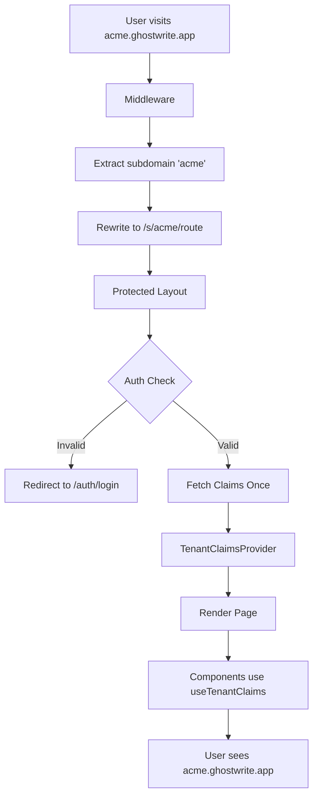

# Architecture Documentation

This directory contains the core architectural documentation for the protected app.

## Quick Reference

| Document                                                        | Purpose                                                 | When to Read                                            |
| --------------------------------------------------------------- | ------------------------------------------------------- | ------------------------------------------------------- |
| [**Multi-Tenant Architecture**](./MULTI_TENANT_ARCHITECTURE.md) | Subdomain routing, tenant isolation, security model     | Setting up new environment, understanding URL structure |
| [**Centralized Auth**](./CENTRALIZED_AUTH.md)                   | Single auth check pattern, context sharing, caching     | Adding new protected pages, troubleshooting auth        |
| [**Component Organization**](./COMPONENT_ORGANIZATION.md)       | File structure, naming conventions, server/client split | Creating new features, refactoring components           |

## Architecture Overview



## Key Principles

### 1. Subdomain-Based Tenancy

- Each organization gets unique subdomain (e.g., `acme.ghostwrite.app`)
- Clean URLs with middleware rewriting internal structure
- Complete data isolation via RLS policies

### 2. Centralized Authentication

- Single auth check at layout level
- Claims shared via React Context
- No duplicate API calls in components
- Smart caching enabled (60-120s revalidation)

### 3. Feature-Based Organization

- Components organized by feature directory
- Shared components in `shared/` subdirectory
- Server components by default, client only for interactivity
- Page wrappers extract UI logic from routes

## Getting Started

### New Developer Onboarding

1. **Read this first:** [Multi-Tenant Architecture](./MULTI_TENANT_ARCHITECTURE.md)
   - Understand subdomain routing
   - Learn the database schema
   - See how tenants are created

2. **Then read:** [Centralized Auth](./CENTRALIZED_AUTH.md)
   - Learn the auth pattern
   - See how to use `useTenantClaims()`
   - Understand caching strategy

3. **Finally:** [Component Organization](./COMPONENT_ORGANIZATION.md)
   - Learn where to put new components
   - Understand server/client split
   - See naming conventions

### Adding a New Feature

```bash
# 1. Create feature component directory
mkdir -p apps/protected/components/my-feature

# 2. Add components
# - my-feature-wrapper.tsx (client component with useTenantClaims)
# - supporting components...

# 3. Create route
# apps/protected/app/s/[subdomain]/(protected)/my-feature/page.tsx
export const revalidate = 60;
export default async function MyFeaturePage() {
  return <MyFeatureWrapper />;
}
```

### Common Patterns

#### Protected Page with Role Check

```tsx
// page.tsx (server component)
export const revalidate = 60;

export default async function AdminPage() {
  const supabase = await createClient();
  const { data: claims } = await supabase.auth.getClaims();

  if (!["owner", "admin"].includes(claims?.claims.user_role)) {
    redirect("/dashboard?error=unauthorized");
  }

  return <AdminWrapper />;
}
```

#### Client Component Using Auth

```tsx
// wrapper.tsx (client component)
"use client";

import { useTenantClaims } from "@/lib/contexts/tenant-claims-context";

export function MyFeatureWrapper() {
  const claims = useTenantClaims(); // No API call!

  return <div>Welcome, {claims.full_name}</div>;
}
```

## Architecture Decision Records

### Why Centralized Auth?

**Problem:** Pages were making 3-4 duplicate auth checks, causing slow loads.

**Solution:** Check auth once in layout, share via context.

**Result:** 14x faster cached page loads (700ms → 50ms).

### Why Subdomain-Based Tenancy?

**Problem:** Multi-tenant apps need isolation and professional URLs.

**Solution:** Each tenant gets subdomain with middleware rewriting.

**Result:** Clean URLs, complete RLS isolation, better SEO.

### Why Feature-Based Components?

**Problem:** Flat component directory became unmanageable.

**Solution:** Organize by feature, shared for reusables.

**Result:** Easy to find components, clear boundaries, obvious reusability.

## Related Documentation

- [Auth Flow](/docs/auth-flow.md) - Complete authentication flow with diagrams
- [Database Schema](/docs/database/DATABASE_SCHEMA.md) - Database structure
- [RBAC System](/docs/rbac-settings/RBAC_QUICK_REFERENCE.md) - Role-based access control
- [Custom Claims Hook](/docs/SUPABASE_CUSTOM_CLAIMS_HOOK.md) - JWT enrichment
- [Local Development](/docs/setup/LOCAL_DEVELOPMENT.md) - Getting started locally

## Contributing

When updating architecture:

1. Update the relevant doc in this directory
2. Add code examples showing "how"
3. Keep "why" to 2-3 bullet points
4. Update this README if adding new doc
5. Link from related docs

## Questions?

- **Auth not working?** → [Centralized Auth troubleshooting](./CENTRALIZED_AUTH.md#troubleshooting)
- **Subdomain issues?** → [Multi-Tenant troubleshooting](./MULTI_TENANT_ARCHITECTURE.md#troubleshooting)
- **Component placement?** → [Component Organization rules](./COMPONENT_ORGANIZATION.md#component-placement-rules)
