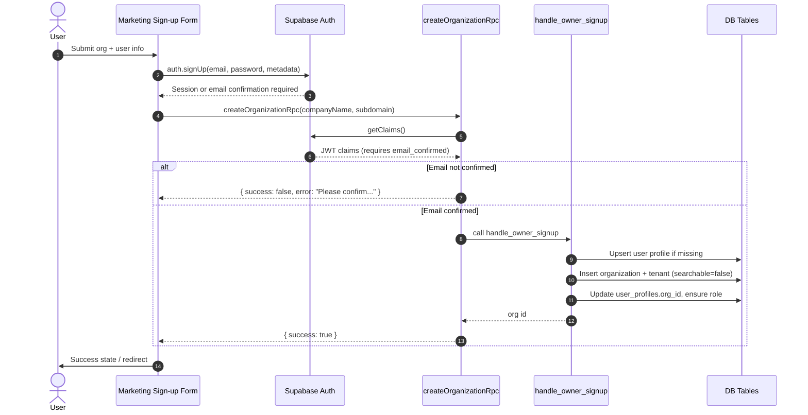
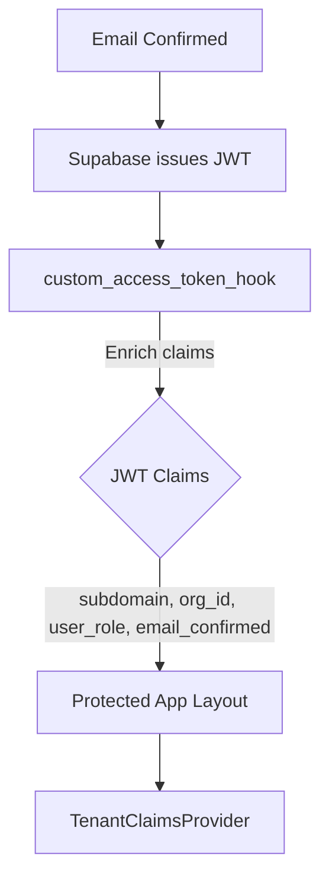
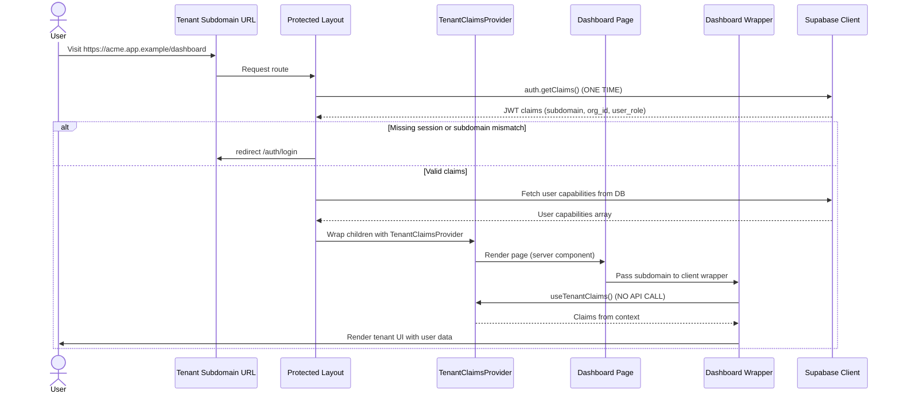

<!-- docs/auth-flow.md -->

# Auth Flow Overview

A high-level walkthrough of the signup → email confirmation → protected app access flow, with centralized authentication, context-based claims sharing, and RLS enforcement.

## Key Components

- **Marketing Signup**
  - `apps/marketing/components/organization-signup-form.tsx` - Client UI handling validation and signup
  - `apps/marketing/app/actions.ts#createOrganizationRpc` - Server action validating input and invoking RPC
  - `public.handle_owner_signup` (PL/pgSQL) - Provisions organizations, tenants, and links owner

- **Protected App Auth**
  - `apps/protected/app/s/[subdomain]/(protected)/layout.tsx` - **Single auth check** for entire app
  - `apps/protected/lib/contexts/tenant-claims-context.tsx` - React Context providing `useTenantClaims()` hook
  - `apps/protected/components/shared/subdomain-auth-checker.tsx` - Client-side guard for root tenant page only

## Core Tables & Policies

| Table                                                                    | Purpose                                    | Critical Policies                                                      |
| ------------------------------------------------------------------------ | ------------------------------------------ | ---------------------------------------------------------------------- |
| `public.user_profiles`                                                   | Stores per-user org membership + role.     | `profiles_self_*`, `profiles_org_admin_*`                              |
| `public.organizations`                                                   | Tenant owner metadata.                     | `organizations_owner_*`, `organizations_service_*`                     |
| `public.tenants`                                                         | Public-facing tenant info keyed by org id. | `tenants_owner_*`, `tenants_admin_*`, `tenants_anon_select_searchable` |
| `public.subscriptions`, `public.usage_counters`, `public.feature_limits` | Billing scaffolding.                       | `subscriptions_*`, `usage_*`                                           |

All policies align with the `rls-policies` guide: separate per-operation rules, `(select auth.uid())` usage, and owner/admin isolation.

## Signup & Provisioning



### Data Passthrough Highlights

- `auth.signUp` metadata seeds `custom_access_token_hook` (role, subdomain, org_id)
- RPC enforces profile linkage and tenant creation in a single transaction
- `tenants.searchable` defaults to `false` to prevent premature discovery

## Email Confirmation & Claims



- `custom_access_token_hook` joins `user_profiles` + `tenants` to populate `subdomain`, `org_id`, `company_name`, `user_role`, `capabilities`
- Layout performs **one auth check** and shares data via React Context
- All pages/components access claims via `useTenantClaims()` hook - **no duplicate API calls**

## First Login to Protected App (Centralized Auth)



### Key Architecture Points

1. **Single Auth Check**: Layout calls `getClaims()` once for entire app
2. **Context Sharing**: `TenantClaimsProvider` makes auth data available to all components
3. **No Duplicate Calls**: Pages/components use `useTenantClaims()` hook instead of calling Supabase
4. **Server Components First**: Pages are server components by default, wrappers are client components
5. **Smart Caching**: Pages use `export const revalidate` for caching (auth is handled upstream)

### Auth Check Pattern

```tsx
// ✅ CORRECT: Layout - Single auth check
// apps/protected/app/s/[subdomain]/(protected)/layout.tsx
export default async function ProtectedLayout({ children, params }) {
  const supabase = await createClient();
  const { data: claims } = await supabase.auth.getClaims();

  if (!claims || claims.claims.subdomain !== subdomain) {
    redirect("/auth/login");
  }

  // Fetch capabilities once
  const { data: capabilities } = await supabase
    .from("user_capabilities")
    .select("capability_key");

  const tenantClaims = {
    user_id: claims.sub,
    email: claims.email,
    subdomain: claims.claims.subdomain,
    org_id: claims.claims.org_id,
    company_name: claims.claims.company_name,
    full_name: claims.claims.full_name,
    user_role: claims.claims.user_role,
    capabilities: capabilities?.map((c) => c.capability_key) || [],
  };

  return (
    <TenantClaimsProvider claims={tenantClaims}>
      {children}
    </TenantClaimsProvider>
  );
}
```

```tsx
// ✅ CORRECT: Page - Minimal, uses context
export const revalidate = 60;

export default async function DashboardPage({ params }) {
  return <DashboardWrapper />;
}
```

```tsx
// ✅ CORRECT: Wrapper - Accesses claims from context
"use client";

export function DashboardWrapper() {
  const claims = useTenantClaims(); // No API call!

  return (
    <div>
      <h1>Welcome, {claims.full_name}</h1>
      <p>Organization: {claims.company_name}</p>
    </div>
  );
}
```

### Role-Based Access in Pages

For pages requiring specific roles, add a simple check after layout auth:

```tsx
// apps/protected/app/s/[subdomain]/(protected)/admin/page.tsx
export const revalidate = 60;

export default async function AdminPage() {
  const supabase = await createClient();
  const { data: claims } = await supabase.auth.getClaims();
  const userRole = claims?.claims.user_role;

  if (!["owner", "admin", "superadmin"].includes(userRole)) {
    redirect("/dashboard?error=insufficient_permissions");
  }

  return <AdminWrapper />;
}
```

**Note:** This is not a duplicate auth check - layout already verified the session exists and subdomain matches. This is just a **role authorization** check.

### RLS Enforcement During Usage

- Dashboard data fetches rely on:
  - `tenants_owner_select` / `tenants_admin_select`
  - `organizations_owner_*` for owner operations
  - `profiles_self_*` for self updates
  - `profiles_org_admin_*` for admin management
- Billing features require membership via `subscriptions_member_read` or admin manage policies
- All queries automatically filtered by RLS based on `auth.uid()` and organization context

## Caching Strategy

Pages use smart caching based on data volatility:

| Page Type          | Cache Time         | Reason                                  |
| ------------------ | ------------------ | --------------------------------------- |
| Dashboard          | `revalidate = 60`  | Stats can be 60s stale                  |
| Profile            | `revalidate = 120` | Rarely changes                          |
| Team Settings      | `revalidate = 30`  | More dynamic                            |
| Org Settings       | `revalidate = 60`  | Infrequent changes                      |
| **Billing**        | `noStore()`        | **Needs real-time subscription status** |
| **Audit Logs**     | `noStore()`        | **Must be immediately fresh**           |
| **Security Pages** | `revalidate = 120` | Settings change infrequently            |

Auth checks at the layout level don't prevent page caching - the layout auth runs on every request, but page content can be cached.

## Component Organization

```
apps/protected/components/
├── auth/                    # Authentication flow components
│   ├── login-form.tsx
│   ├── forgot-password-form.tsx
│   └── update-password-form.tsx
├── dashboard/               # Dashboard-specific
│   ├── dashboard-wrapper.tsx
│   ├── stats-card.tsx
│   └── activity-feed.tsx
├── org-settings/            # Organization settings
│   ├── general/
│   ├── roles/
│   └── team/
└── shared/                  # Used across 2+ routes
    ├── app-sidebar.tsx
    ├── providers.tsx
    ├── require-tenant-auth.tsx (legacy)
    └── role-protected-action.tsx
```

## Troubleshooting Checklist

- **Missing org context:** Verify `user_profiles.org_id` populated (RPC handles upsert)
- **Unauthorized tenant access:** Confirm JWT `subdomain` matches route and `tenants` policy grants
- **Signup stalls:** Ensure email confirmed; UI surfaces pending state
- **Slow page loads:** Check for duplicate `getClaims()` calls - should only be in layout
- **"useTenantClaims must be used within TenantClaimsProvider" error:** Component is outside layout's `<TenantClaimsProvider>` wrapper
- **Type mismatches:** Regenerate types with `supabase gen typescript types --project-id qnbqrlpvokzgtfevnuzv`

## Performance Benefits

The centralized auth architecture provides:

- **14x faster** cached page loads (700ms → 50ms)
- **60% fewer** database queries (eliminated duplicate auth checks)
- **Instant** client-side navigation (React context instead of API calls)
- **Better DX** - Clear separation of server/client boundaries

## References

- [Performance & Caching Strategy](/docs/PERFORMANCE_CACHING.md) - Detailed caching guide
- [Page Wrappers Guide](/docs/page-wrappers.md) - Component organization patterns
- [Supabase Custom Claims Hook](/docs/SUPABASE_CUSTOM_CLAIMS_HOOK.md) - JWT enrichment
- [Next.js Caching](https://nextjs.org/docs/app/building-your-application/caching) - Official docs

---

This flow ensures marketing signup UX remains clean, enforces tenant isolation end-to-end with centralized auth, and ensures all data access remains behind RLS-compliant paths with optimal performance.
