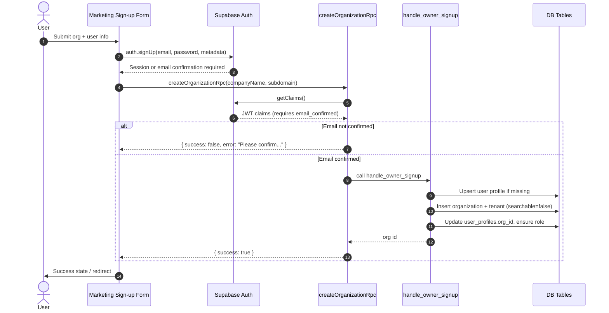
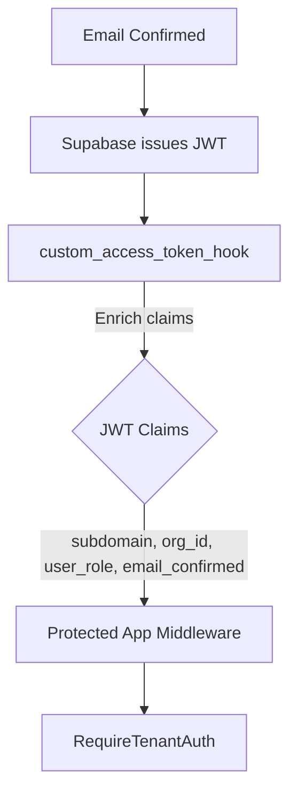
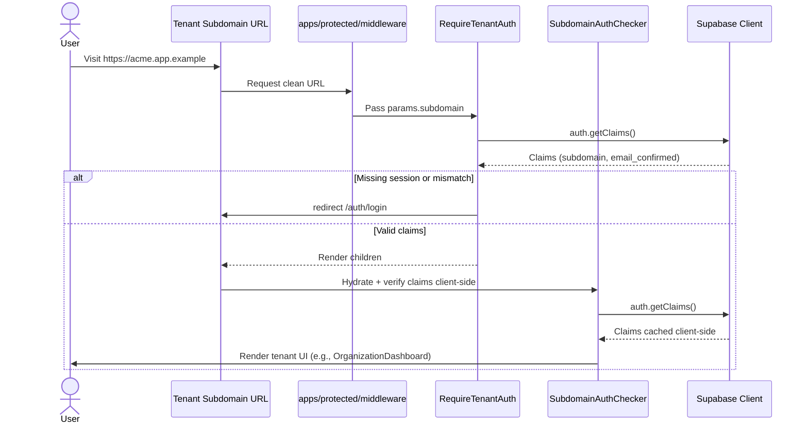

# Auth Flow Overview

A high-level walkthrough of the signup → email confirmation → protected app access flow, with the primary components, database touchpoints, and RLS enforcement clarified.

## Key Components

- `apps/marketing/components/organization-signup-form.tsx`
  - client UI handling validation, signup, and post-auth states.
- `apps/marketing/app/actions.ts#createOrganizationRpc`
  - server action validating input, ensuring confirmed email, invoking the RPC.
- `public.handle_owner_signup` (PL/pgSQL)
  - ensures profile existence, provisions `organizations` + `tenants`, links owner.
- `apps/protected/components/require-tenant-auth.tsx`
  - server wrapper performing claims checks (subdomain + email confirmed).
- `apps/protected/components/subdomain-auth-checker.tsx`
  - client-side guard for tenant routes.

## Core Tables & Policies

| Table                                                                    | Purpose                                    | Critical Policies                                                      |
| ------------------------------------------------------------------------ | ------------------------------------------ | ---------------------------------------------------------------------- |
| `public.user_profiles`                                                   | Stores per-user org membership + role.     | `profiles_self_*`, `profiles_org_admin_*`                              |
| `public.organizations`                                                   | Tenant owner metadata.                     | `organizations_owner_*`, `organizations_service_*`                     |
| `public.tenants`                                                         | Public-facing tenant info keyed by org id. | `tenants_owner_*`, `tenants_admin_*`, `tenants_anon_select_searchable` |
| `public.subscriptions`, `public.usage_counters`, `public.feature_limits` | Billing scaffolding.                       | `subscriptions_*`, `usage_*`                                           |

All policies align with the `rls-policies` guide: separate per-operation rules, `(select auth.uid())` usage, and owner/admin isolation.

## Signup & Provisioning

### Data Passthrough Highlights

- `auth.signUp` metadata seeds `custom_access_token_hook` (role, subdomain, org_id).
- RPC enforces profile linkage and tenant creation in a single transaction.
- `tenants.searchable` defaults to `false` to prevent premature discovery.

## Email Confirmation & Claims

- `custom_access_token_hook` joins `user_profiles` + `tenants` to populate `subdomain`, `org_id`, `company_name`, `user_role`.
- `RequireTenantAuth` demands `claims.email_confirmed === true` and matching route subdomain before rendering children.

## First Login to Protected App

### RLS Enforcement During Usage

- Dashboard data fetches rely on:
  - `tenants_owner_select` / `tenants_admin_select`
  - `organizations_owner_*` for owner operations
  - `profiles_self_*` for self updates
  - `profiles_org_admin_*` for admin management
- Billing features require membership via `subscriptions_member_read` or admin manage policies.

## Troubleshooting Checklist

- **Missing org context:** verify `user_profiles.org_id` populated (RPС handles upsert).
- **Unauthorized tenant access:** confirm JWT `subdomain` matches route and `tenants` policy grants.
- **Signup stalls:** ensure email confirmed; UI now surfaces pending state.
- **Type mismatches:** regenerate types with `supabase gen typescript types --project-id qnbqrlpvokzgtfevnuzv`.

This flow keeps marketing signup UX clean, enforces tenant isolation end-to-end, and ensures all data access remains behind RLS-compliant paths.
