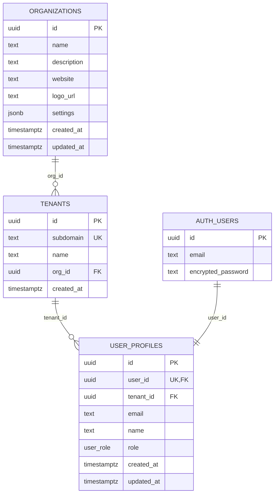

# Database Schema

Complete database structure and relationships for the multi-tenant application.

## Overview

The project includes a complete multi-tenant database setup script (`database-setup.sql`) that creates a comprehensive schema with proper relationships, security policies, and functions.

## Core Tables

### Organizations

```sql
CREATE TABLE organizations (
  id UUID PRIMARY KEY DEFAULT gen_random_uuid(),
  name TEXT NOT NULL,
  description TEXT,
  website TEXT,
  logo_url TEXT,
  settings JSONB DEFAULT '{}',
  created_at TIMESTAMPTZ DEFAULT NOW(),
  updated_at TIMESTAMPTZ DEFAULT NOW()
);
```

### Tenants

```sql
CREATE TABLE tenants (
  id UUID PRIMARY KEY DEFAULT gen_random_uuid(),
  subdomain TEXT UNIQUE NOT NULL,
  name TEXT NOT NULL,
  org_id UUID REFERENCES organizations(id) ON DELETE CASCADE,
  created_at TIMESTAMPTZ DEFAULT NOW()
);
```

### User Profiles

```sql
CREATE TABLE user_profiles (
  id UUID PRIMARY KEY DEFAULT gen_random_uuid(),
  user_id UUID REFERENCES auth.users(id) ON DELETE CASCADE,
  tenant_id UUID REFERENCES tenants(id) ON DELETE CASCADE,
  email TEXT NOT NULL,
  name TEXT,
  role user_role DEFAULT 'member',
  created_at TIMESTAMPTZ DEFAULT NOW(),
  updated_at TIMESTAMPTZ DEFAULT NOW()
);
```

### Auth Users

```sql
-- Managed by Supabase Auth
-- Contains: id, email, encrypted_password, etc.
```

## Entity Relationship Diagram



## Key Features

- 🏢 **Organizations**: Company/group management
- 🌐 **Tenants**: Subdomain to organization mapping
- 👤 **User Profiles**: Extended user data with tenant relationships
- 🔐 **Role-Based Access**: `superadmin` → `admin` → `member` → `view-only`
- 🛡️ **Row Level Security**: Comprehensive RLS policies for tenant isolation

## Verified Schema (via Supabase MCP)

### Core Tables (all RLS enabled)

- `organizations`, `tenants`, `user_profiles` - Multi-tenant org structure
- `subscriptions`, `subscription_tiers`, `feature_limits`, `usage_counters` - Billing & usage
- `projects`, `project_permissions` - Project management with granular access
- `capabilities`, `role_capabilities`, `org_role_capabilities` - RBAC system

### Views

- `tenants_public` - Public subdomain lookup
- `org_entitlements` - Subscription tier & feature aggregation

### Key Functions

- `bootstrap_organization()` - Initialize new org after signup
- `custom_access_token_hook()` - Enrich JWT with role/org claims
- `feature_increment_if_within_limit()` - Usage quota enforcement
- `user_org_access()` - Check org membership & role
- `user_org_capability()` - Check RBAC capability permissions
- `user_project_access()` - Check project-level permissions
- `handle_new_project()` - Auto-grant creator admin access
- Trigger functions: `set_updated_at()`, `sync_user_email()`, `prevent_user_id_change()`

## Row Level Security (RLS)

### Organizations Table

```sql
-- Users can view organizations they belong to
CREATE POLICY "Users can view own organizations" ON organizations
  FOR SELECT USING (
    id IN (
      SELECT t.org_id
      FROM tenants t
      JOIN user_profiles up ON t.id = up.tenant_id
      WHERE up.user_id = auth.uid()
    )
  );

-- Only owners can update organization settings
CREATE POLICY "Owners can update organization" ON organizations
  FOR UPDATE USING (
    id IN (
      SELECT t.org_id
      FROM tenants t
      JOIN user_profiles up ON t.id = up.tenant_id
      WHERE up.user_id = auth.uid() AND up.role = 'owner'
    )
  );
```

### Tenants Table

```sql
-- Users can view tenants from their organization
CREATE POLICY "Users can view own tenants" ON tenants
  FOR SELECT USING (
    org_id IN (
      SELECT t.org_id
      FROM tenants t
      JOIN user_profiles up ON t.id = up.tenant_id
      WHERE up.user_id = auth.uid()
    )
  );
```

### User Profiles Table

```sql
-- Users can view profiles in their tenant
CREATE POLICY "Users can view tenant profiles" ON user_profiles
  FOR SELECT USING (
    tenant_id IN (
      SELECT up.tenant_id
      FROM user_profiles up
      WHERE up.user_id = auth.uid()
    )
  );

-- Users can update their own profile
CREATE POLICY "Users can update own profile" ON user_profiles
  FOR UPDATE USING (auth.uid() = user_id);
```

## Database Functions

### Bootstrap Organization

```sql
CREATE OR REPLACE FUNCTION bootstrap_organization(
  org_name TEXT,
  subdomain TEXT,
  user_id UUID
) RETURNS UUID
LANGUAGE plpgsql
SECURITY DEFINER
AS $$
DECLARE
  org_id UUID;
  tenant_id UUID;
BEGIN
  -- Create organization
  INSERT INTO organizations (name)
  VALUES (org_name)
  RETURNING id INTO org_id;

  -- Create tenant
  INSERT INTO tenants (subdomain, name, org_id)
  VALUES (subdomain, org_name, org_id)
  RETURNING id INTO tenant_id;

  -- Create user profile
  INSERT INTO user_profiles (user_id, tenant_id, email, role)
  VALUES (user_id, tenant_id, auth.email(), 'owner');

  RETURN org_id;
END;
$$;
```

### Custom Access Token Hook

```sql
CREATE OR REPLACE FUNCTION custom_access_token_hook(event jsonb)
RETURNS jsonb
LANGUAGE plpgsql
SECURITY DEFINER
AS $$
DECLARE
  claims jsonb;
  user_profile record;
BEGIN
  -- Get user profile with organization info
  SELECT
    up.id,
    up.role,
    up.tenant_id,
    t.subdomain,
    o.id as org_id,
    o.name as org_name
  INTO user_profile
  FROM user_profiles up
  JOIN tenants t ON up.tenant_id = t.id
  JOIN organizations o ON t.org_id = o.id
  WHERE up.user_id = (event->>'user_id')::uuid;

  -- Build custom claims
  claims := jsonb_build_object(
    'subdomain', user_profile.subdomain,
    'role', user_profile.role,
    'org_id', user_profile.org_id,
    'org_name', user_profile.org_name,
    'tenant_id', user_profile.tenant_id
  );

  -- Add claims to the event
  event := jsonb_set(event, '{claims}', claims);

  RETURN event;
END;
$$;
```

### User Organization Access

```sql
CREATE OR REPLACE FUNCTION user_org_access(
  p_user_id UUID,
  p_org_id UUID,
  p_required_roles TEXT[]
) RETURNS BOOLEAN
LANGUAGE plpgsql
SECURITY DEFINER
AS $$
DECLARE
  user_role TEXT;
BEGIN
  -- Get user's role in the organization
  SELECT up.role INTO user_role
  FROM user_profiles up
  JOIN tenants t ON up.tenant_id = t.id
  WHERE up.user_id = p_user_id AND t.org_id = p_org_id;

  -- Check if user has required role
  RETURN user_role = ANY(p_required_roles);
END;
$$;
```

### User Organization Capability

```sql
CREATE OR REPLACE FUNCTION user_org_capability(
  p_user_id UUID,
  p_org_id UUID,
  p_capability_key TEXT
) RETURNS BOOLEAN
LANGUAGE plpgsql
SECURITY DEFINER
AS $$
DECLARE
  user_role TEXT;
  has_capability BOOLEAN := FALSE;
BEGIN
  -- Get user's role in the organization
  SELECT up.role INTO user_role
  FROM user_profiles up
  JOIN tenants t ON up.tenant_id = t.id
  WHERE up.user_id = p_user_id AND t.org_id = p_org_id;

  -- Check if user has capability through role
  SELECT EXISTS(
    SELECT 1 FROM role_capabilities rc
    JOIN capabilities c ON rc.capability_id = c.id
    WHERE rc.role = user_role::user_role
    AND c.key = p_capability_key
  ) INTO has_capability;

  -- Check for custom organization overrides
  IF NOT has_capability THEN
    SELECT EXISTS(
      SELECT 1 FROM org_role_capabilities orc
      JOIN capabilities c ON orc.capability_id = c.id
      WHERE orc.org_id = p_org_id
      AND orc.role = user_role::user_role
      AND c.key = p_capability_key
    ) INTO has_capability;
  END IF;

  RETURN has_capability;
END;
$$;
```

## Database Views

### Tenants Public View

```sql
CREATE VIEW tenants_public AS
SELECT
  t.subdomain,
  t.name,
  o.name as org_name,
  o.website,
  o.logo_url
FROM tenants t
JOIN organizations o ON t.org_id = o.id
WHERE o.settings->>'public' = 'true';
```

### Organization Entitlements View

```sql
CREATE VIEW org_entitlements AS
SELECT
  o.id as org_id,
  o.name as org_name,
  s.tier,
  s.status,
  fl.feature_key,
  fl.limit_value,
  uc.current_usage
FROM organizations o
LEFT JOIN subscriptions s ON o.id = s.org_id
LEFT JOIN feature_limits fl ON s.tier = fl.tier
LEFT JOIN usage_counters uc ON o.id = uc.org_id AND fl.feature_key = uc.feature_key;
```

## Database Triggers

### Set Updated At

```sql
CREATE OR REPLACE FUNCTION set_updated_at()
RETURNS TRIGGER AS $$
BEGIN
  NEW.updated_at = NOW();
  RETURN NEW;
END;
$$ LANGUAGE plpgsql;

-- Apply to relevant tables
CREATE TRIGGER set_organizations_updated_at
  BEFORE UPDATE ON organizations
  FOR EACH ROW EXECUTE FUNCTION set_updated_at();

CREATE TRIGGER set_user_profiles_updated_at
  BEFORE UPDATE ON user_profiles
  FOR EACH ROW EXECUTE FUNCTION set_updated_at();
```

### Sync User Email

```sql
CREATE OR REPLACE FUNCTION sync_user_email()
RETURNS TRIGGER AS $$
BEGIN
  -- Update user profile email when auth user email changes
  UPDATE user_profiles
  SET email = NEW.email
  WHERE user_id = NEW.id;

  RETURN NEW;
END;
$$ LANGUAGE plpgsql;

CREATE TRIGGER sync_user_email_trigger
  AFTER UPDATE ON auth.users
  FOR EACH ROW EXECUTE FUNCTION sync_user_email();
```

## Database Indexes

### Performance Indexes

```sql
-- Tenant subdomain lookup
CREATE INDEX idx_tenants_subdomain ON tenants(subdomain);

-- User profile lookups
CREATE INDEX idx_user_profiles_user_id ON user_profiles(user_id);
CREATE INDEX idx_user_profiles_tenant_id ON user_profiles(tenant_id);

-- Organization lookups
CREATE INDEX idx_tenants_org_id ON tenants(org_id);

-- Role-based queries
CREATE INDEX idx_user_profiles_role ON user_profiles(role);
```

## Database Migrations

### Initial Migration

```sql
-- Create custom types
CREATE TYPE user_role AS ENUM ('superadmin', 'owner', 'admin', 'member', 'view-only');

-- Create tables with proper relationships
-- (See individual table definitions above)

-- Enable RLS on all tables
ALTER TABLE organizations ENABLE ROW LEVEL SECURITY;
ALTER TABLE tenants ENABLE ROW LEVEL SECURITY;
ALTER TABLE user_profiles ENABLE ROW LEVEL SECURITY;

-- Create RLS policies
-- (See RLS policy definitions above)

-- Create functions and triggers
-- (See function definitions above)
```

### Schema Updates

```sql
-- Add new columns
ALTER TABLE organizations ADD COLUMN settings JSONB DEFAULT '{}';

-- Add new indexes
CREATE INDEX idx_organizations_settings ON organizations USING GIN(settings);

-- Update RLS policies
-- (Update existing policies as needed)
```

## Database Backup and Recovery

### Backup Strategy

```bash
# Full database backup
pg_dump -h your-supabase-host -U postgres -d postgres > backup.sql

# Schema-only backup
pg_dump -h your-supabase-host -U postgres -d postgres --schema-only > schema.sql

# Data-only backup
pg_dump -h your-supabase-host -U postgres -d postgres --data-only > data.sql
```

### Recovery Procedures

```bash
# Restore from backup
psql -h your-supabase-host -U postgres -d postgres < backup.sql

# Restore schema only
psql -h your-supabase-host -U postgres -d postgres < schema.sql

# Restore data only
psql -h your-supabase-host -U postgres -d postgres < data.sql
```

## Performance Optimization

### Query Optimization

- Use proper indexes for common queries
- Optimize RLS policies for performance
- Use connection pooling
- Monitor slow queries

### Database Monitoring

- Set up query performance monitoring
- Monitor connection usage
- Track database size growth
- Alert on performance issues

## Security Best Practices

### Access Control

- Use RLS for all tables
- Implement proper user roles
- Audit database access
- Regular security reviews

### Data Protection

- Encrypt sensitive data
- Use proper authentication
- Implement audit logging
- Regular backup testing

## Troubleshooting

### Common Issues

1. **RLS Policy Issues**: Check policy definitions
2. **Performance Problems**: Analyze query execution plans
3. **Connection Issues**: Check connection limits
4. **Migration Failures**: Verify migration scripts

### Debug Tools

- Use `EXPLAIN ANALYZE` for query optimization
- Monitor database logs
- Use Supabase dashboard for insights
- Set up proper alerting

## Next Steps

1. **Set up Monitoring**: Configure database monitoring
2. **Implement Backups**: Set up automated backup procedures
3. **Optimize Performance**: Monitor and optimize query performance
4. **Security Review**: Regular security audits and updates
