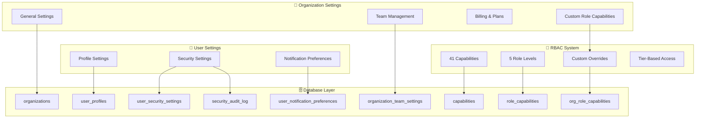

# RBAC Architecture Overview

## System Architecture

## Key Features

- **Multi-Tenant Architecture**: Subdomain-based tenant isolation
- **Role-Based Access Control**: 5 role levels with 41 granular capabilities
- **Custom Permissions**: Business+ tier organizations can customize role capabilities
- **Security Features**: 2FA, session management, audit logging
- **Settings Management**: User and organization settings with proper permissions
- **Navigation Filtering**: Automatic UI filtering based on user capabilities

## Documentation Structure

- [User Settings](./USER_SETTINGS.md) - Profile, security, and notification management
- [Organization Settings](./ORGANIZATION_SETTINGS.md) - Team, billing, and role management
- [RBAC System](./RBAC_SYSTEM.md) - Role hierarchy, capabilities, and custom permissions
- [Database Schema](./DATABASE_SCHEMA.md) - Complete database structure and relationships
- [Security Features](./SECURITY_FEATURES.md) - 2FA, sessions, audit logging
- [Testing Guide](./TESTING_GUIDE.md) - Comprehensive testing scenarios
- [Quick Reference](./RBAC_QUICK_REFERENCE.md) - Developer reference for implementation

## Quick Start

1. **Apply Database Migrations**: Run the database setup script
2. **Check User Permissions**: Use the RBAC utilities for permission checking
3. **Implement UI Components**: Use `RequireCapability` and `useCapability` for conditional rendering
4. **Customize Roles**: Business+ organizations can customize role capabilities

See the individual documentation files for detailed implementation guides.
