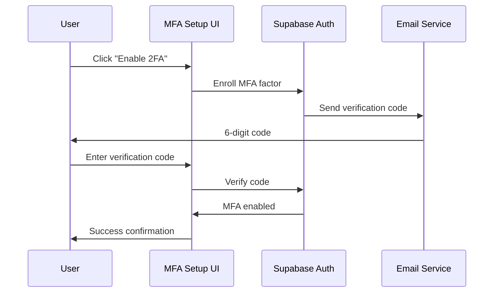
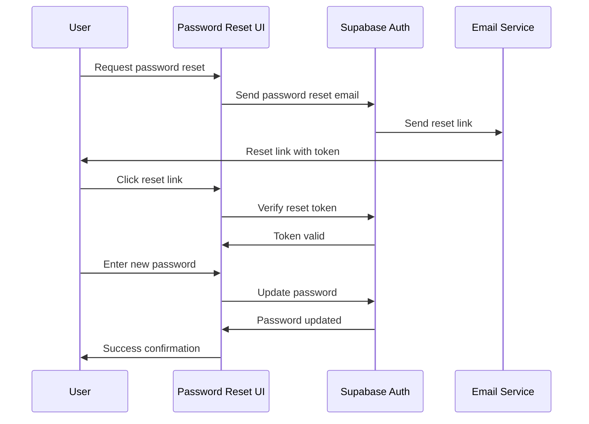

# Security Features

## Multi-Factor Authentication (2FA)

### Email-Based 2FA

The system implements email-based 2FA using 6-digit codes sent via email.

#### Features

- **MFA Setup UI**: Clear onboarding flow for 2FA enrollment
- **Challenge-Response Verification**: Secure verification flow
- **Factor Management**: Enroll, verify, unenroll, list factors
- **Email Integration**: Uses Resend for reliable email delivery

#### Implementation

```typescript
// 2FA setup component
import { MFASetup } from "@/components/mfa-setup";

export function SecuritySettings() {
  return (
    <div className="space-y-6">
      <div>
        <h2 className="text-xl font-semibold">Two-Factor Authentication</h2>
        <p className="text-sm text-muted-foreground">
          Add an extra layer of security to your account.
        </p>
      </div>
      <MFASetup />
    </div>
  );
}
```

#### Database Schema

```sql
-- User security settings with MFA tracking
CREATE TABLE user_security_settings (
  id UUID PRIMARY KEY DEFAULT gen_random_uuid(),
  user_id UUID REFERENCES auth.users(id) ON DELETE CASCADE,
  password_changed_at TIMESTAMPTZ,
  mfa_enabled BOOLEAN DEFAULT FALSE,
  mfa_enrolled_at TIMESTAMPTZ,
  created_at TIMESTAMPTZ DEFAULT NOW(),
  updated_at TIMESTAMPTZ DEFAULT NOW()
);
```

#### MFA Flow



## Session Management

### Active Session Tracking

The system tracks and manages active sessions across devices.

#### Features

- **Session Tracking**: Monitor active sessions across devices
- **Session Revocation**: Revoke specific sessions
- **Current Device Indicator**: Identify the current device
- **Last Active Timestamps**: Track session activity
- **IP Address Logging**: Security monitoring

#### Implementation

```typescript
// Session management component
import { SessionManager } from "@/components/session-manager";

export function ActiveSessions() {
  return (
    <div className="space-y-4">
      <div>
        <h3 className="text-lg font-medium">Active Sessions</h3>
        <p className="text-sm text-muted-foreground">
          Manage your active sessions across devices.
        </p>
      </div>
      <SessionManager />
    </div>
  );
}
```

#### Database Schema

```sql
-- Active sessions tracking
CREATE TABLE user_active_sessions (
  id UUID PRIMARY KEY DEFAULT gen_random_uuid(),
  user_id UUID REFERENCES auth.users(id) ON DELETE CASCADE,
  session_id TEXT UNIQUE,
  device_info JSONB,
  ip_address INET,
  last_active TIMESTAMPTZ DEFAULT NOW(),
  created_at TIMESTAMPTZ DEFAULT NOW()
);
```

#### Session Management Features

```typescript
// Session management utilities
export interface ActiveSession {
  id: string;
  deviceInfo: {
    userAgent: string;
    platform: string;
    browser: string;
  };
  ipAddress: string;
  lastActive: string;
  isCurrent: boolean;
}

// Session management functions
export async function getActiveSessions(): Promise<ActiveSession[]> {
  const supabase = await createClient();
  const { data: sessions } = await supabase
    .from("user_active_sessions")
    .select("*")
    .order("last_active", { ascending: false });

  return sessions || [];
}

export async function revokeSession(sessionId: string): Promise<boolean> {
  const supabase = await createClient();
  const { error } = await supabase
    .from("user_active_sessions")
    .delete()
    .eq("session_id", sessionId);

  return !error;
}
```

## Security Audit Log

### Comprehensive Security Event Logging

The system maintains a detailed audit log of all security-related events.

#### Features

- **Real-Time Logging**: Security events logged immediately
- **Event Categorization**: Organized by event type and severity
- **Severity Levels**: Info, warning, critical
- **Action States**: Success, failure, attempted
- **IP Address Tracking**: Security monitoring
- **User Agent Logging**: Device identification
- **Dedicated Viewer**: Security audit log interface

#### Event Types

```typescript
// Security event types
export type SecurityEventType =
  | "login"
  | "logout"
  | "password_change"
  | "mfa_enabled"
  | "mfa_disabled"
  | "session_created"
  | "session_revoked"
  | "profile_updated"
  | "role_changed"
  | "permission_granted"
  | "permission_revoked";

export type SecuritySeverity = "info" | "warning" | "critical";
export type SecurityActionState = "success" | "failure" | "attempted";
```

#### Database Schema

```sql
-- Security audit log
CREATE TABLE security_audit_log (
  id UUID PRIMARY KEY DEFAULT gen_random_uuid(),
  user_id UUID REFERENCES auth.users(id) ON DELETE CASCADE,
  org_id UUID REFERENCES organizations(id),
  event_type TEXT NOT NULL,
  event_description TEXT,
  severity TEXT DEFAULT 'info',
  action_state TEXT DEFAULT 'success',
  ip_address INET,
  user_agent TEXT,
  metadata JSONB,
  created_at TIMESTAMPTZ DEFAULT NOW()
);
```

#### Audit Log Implementation

```typescript
// Security audit logging
import { logSecurityEvent } from "@/lib/security/audit-log";

// Log security events
await logSecurityEvent(userId, orgId, "login", "success", {
  ipAddress: request.ip,
  userAgent: request.headers["user-agent"],
  metadata: { loginMethod: "email" },
});

await logSecurityEvent(userId, orgId, "mfa_enabled", "success", {
  ipAddress: request.ip,
  userAgent: request.headers["user-agent"],
});

await logSecurityEvent(userId, orgId, "password_change", "success", {
  ipAddress: request.ip,
  userAgent: request.headers["user-agent"],
});
```

#### Audit Log Viewer

```typescript
// Security audit log viewer
import { SecurityAuditLog } from "@/components/security-audit-log";

export function SecurityAuditLogPage() {
  return (
    <div className="space-y-6">
      <div>
        <h2 className="text-xl font-semibold">Security Audit Log</h2>
        <p className="text-sm text-muted-foreground">
          View your account's security activity and events.
        </p>
      </div>
      <SecurityAuditLog />
    </div>
  );
}
```

## Password Security

### Password Management

#### Features

- **Password Reset**: Secure password reset flow
- **Password Change**: Change password with current password verification
- **Password History**: Track password changes
- **Password Strength**: Enforce strong passwords

#### Implementation

```typescript
// Password management component
import { PasswordChangeForm } from "@/components/password-change-form";

export function PasswordSecurity() {
  return (
    <div className="space-y-6">
      <div>
        <h3 className="text-lg font-medium">Password Security</h3>
        <p className="text-sm text-muted-foreground">
          Manage your account password and security settings.
        </p>
      </div>
      <PasswordChangeForm />
    </div>
  );
}
```

#### Password Reset Flow



## Row-Level Security (RLS)

### Database Security

All security-related tables have comprehensive RLS policies.

#### User Security Settings RLS

```sql
-- Users can only access their own security settings
CREATE POLICY "Users can view own security settings" ON user_security_settings
  FOR SELECT USING (auth.uid() = user_id);

CREATE POLICY "Users can update own security settings" ON user_security_settings
  FOR UPDATE USING (auth.uid() = user_id);

-- Active sessions RLS
CREATE POLICY "Users can view own sessions" ON user_active_sessions
  FOR SELECT USING (auth.uid() = user_id);

CREATE POLICY "Users can delete own sessions" ON user_active_sessions
  FOR DELETE USING (auth.uid() = user_id);
```

#### Security Audit Log RLS

```sql
-- Users can view their own audit log
CREATE POLICY "Users can view own audit log" ON security_audit_log
  FOR SELECT USING (auth.uid() = user_id);

-- Organization owners can view org audit log
CREATE POLICY "Owners can view org audit log" ON security_audit_log
  FOR SELECT USING (
    org_id IN (
      SELECT org_id FROM user_profiles
      WHERE user_id = auth.uid() AND role = 'owner'
    )
  );
```

## Security Best Practices

### Implementation Guidelines

1. **Always Use HTTPS**: All security operations require HTTPS
2. **Validate Input**: Sanitize all user inputs
3. **Rate Limiting**: Implement rate limiting for security operations
4. **Audit Everything**: Log all security-related events
5. **Principle of Least Privilege**: Grant minimum required permissions

### Security Headers

```typescript
// Security headers configuration
export const securityHeaders = {
  "Strict-Transport-Security": "max-age=31536000; includeSubDomains",
  "X-Content-Type-Options": "nosniff",
  "X-Frame-Options": "DENY",
  "X-XSS-Protection": "1; mode=block",
  "Referrer-Policy": "strict-origin-when-cross-origin",
  "Content-Security-Policy":
    "default-src 'self'; script-src 'self' 'unsafe-inline'",
};
```

### Environment Variables

```bash
# Security-related environment variables
SENTRY_DSN=your_sentry_dsn
SENTRY_AUTH_TOKEN=your_sentry_auth_token
RESEND_API_KEY=your_resend_api_key
SUPABASE_SERVICE_ROLE_KEY=your_service_role_key
```

## Testing Security Features

### Security Testing Checklist

- ✅ **2FA Setup**: Test MFA enrollment and verification
- ✅ **Session Management**: Test session creation and revocation
- ✅ **Audit Logging**: Verify all security events are logged
- ✅ **Password Security**: Test password reset and change flows
- ✅ **RLS Policies**: Verify database access controls
- ✅ **Rate Limiting**: Test security operation rate limits
- ✅ **Input Validation**: Test security input sanitization

### Security Test Scenarios

```typescript
// Security testing examples
describe("Security Features", () => {
  test("should log security events", async () => {
    await logSecurityEvent(userId, orgId, "login", "success");
    const events = await getSecurityEvents(userId);
    expect(events).toHaveLength(1);
    expect(events[0].event_type).toBe("login");
  });

  test("should enforce RLS policies", async () => {
    // Test that users can only access their own data
    const otherUserData = await getUserSecuritySettings(otherUserId);
    expect(otherUserData).toBeNull();
  });

  test("should validate MFA setup", async () => {
    const mfaResult = await setupMFA(userId);
    expect(mfaResult.success).toBe(true);
    expect(mfaResult.mfaEnabled).toBe(true);
  });
});
```

## Monitoring and Alerting

### Security Monitoring

- **Failed Login Attempts**: Monitor and alert on suspicious activity
- **MFA Bypass Attempts**: Track unauthorized access attempts
- **Session Anomalies**: Detect unusual session patterns
- **Permission Changes**: Monitor role and capability modifications
- **Data Access Patterns**: Track unusual data access

### Integration with Sentry

```typescript
// Security event monitoring with Sentry
import * as Sentry from "@sentry/nextjs";

// Log security events to Sentry
export async function logSecurityEvent(
  userId: string,
  orgId: string,
  eventType: string,
  actionState: string,
  metadata?: any
) {
  // Log to database
  await supabase.from("security_audit_log").insert({
    user_id: userId,
    org_id: orgId,
    event_type: eventType,
    action_state: actionState,
    metadata: metadata,
  });

  // Log to Sentry for monitoring
  Sentry.addBreadcrumb({
    category: "security",
    message: `Security event: ${eventType}`,
    level: "info",
    data: { userId, orgId, eventType, actionState },
  });
}
```

## Compliance and Privacy

### Data Protection

- **Data Encryption**: All sensitive data encrypted at rest and in transit
- **Data Retention**: Configurable data retention policies
- **Data Anonymization**: Personal data anonymization capabilities
- **GDPR Compliance**: Right to be forgotten implementation
- **Audit Trails**: Complete audit trails for compliance

### Privacy Controls

- **Data Export**: Users can export their data
- **Data Deletion**: Secure data deletion processes
- **Consent Management**: User consent tracking
- **Privacy Settings**: Granular privacy controls
