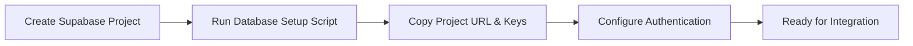
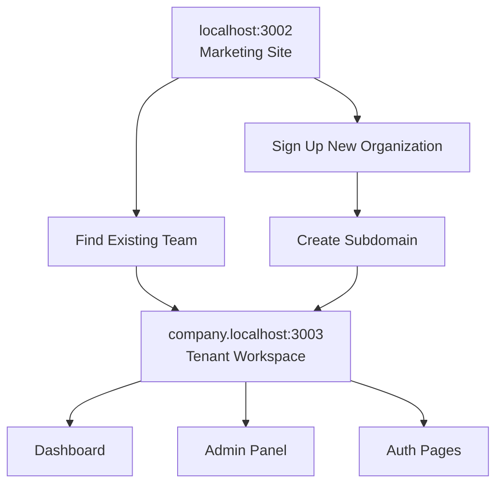

# Local Development Setup

Complete guide for setting up the subdomain-isolated Turborepo for local development.

## Prerequisites

- ✅ Node.js 20 or later
- ✅ pnpm (recommended package manager)
- ✅ Supabase account (for authentication)

## Step 1: Repository Setup

```bash
# Clone and navigate to your repository
git clone <your-repo-url>
cd subdomain-isolated-turborepo

# Install all dependencies
pnpm install
```

## Step 2: Supabase Project Setup



1. **Create Supabase Project**: Go to [supabase.com](https://supabase.com) and create a new project
2. **Set up Database Structure**:
   - Open the SQL Editor in your Supabase dashboard
   - Copy and run the complete `database-setup.sql` script (located in repository root)
   - This creates all necessary tables, RLS policies, and functions for multi-tenant architecture
3. **Copy Credentials**: Navigate to Project Settings → API to get:
   - Project URL
   - Anon/Public Key
   - Service Role Key (for server-side operations)

## Step 3: Environment Variables Setup

Create `.env.local` files in both apps with your Supabase credentials:

**📁 `apps/marketing/.env.local`**

```bash
# Supabase Configuration
NEXT_PUBLIC_SUPABASE_URL=your_supabase_project_url
NEXT_PUBLIC_SUPABASE_PUBLISHABLE_OR_ANON_KEY=your_supabase_anon_key

# Domain Configuration
NEXT_PUBLIC_APP_DOMAIN=yourdomain.com
NEXT_PUBLIC_MARKETING_DOMAIN=yourdomain.com
```

**📁 `apps/protected/.env.local`**

```bash
# Supabase Configuration
NEXT_PUBLIC_SUPABASE_URL=your_supabase_project_url
NEXT_PUBLIC_SUPABASE_PUBLISHABLE_OR_ANON_KEY=your_supabase_anon_key

# Domain Configuration
NEXT_PUBLIC_APP_DOMAIN=yourdomain.com
NEXT_PUBLIC_MARKETING_DOMAIN=yourdomain.com
```

**Important Notes:**

- Do not expose `SUPABASE_SERVICE_ROLE_KEY` to clients. If needed for admin tasks, use server-only utilities and environment scoping.
- Use the same Supabase project for both apps to maintain data consistency.

## Step 4: Start Development Servers

```bash
# Option 1: Run both apps simultaneously
pnpm dev

# Option 2: Run individual apps
pnpm --filter marketing dev    # Port 3002
pnpm --filter protected dev    # Port 3003
```

## Step 5: Access Your Applications

- 🏠 **Marketing Site**: http://localhost:3002
- 🔒 **Protected App**: http://localhost:3003
- 🏢 **Tenant Subdomains**: http://[company].localhost:3003



## Development Workflow

### Testing Subdomains Locally

To test subdomains locally, you have several options:

1. **Using /etc/hosts (Recommended)**:

   ```bash
   # Add to /etc/hosts
   127.0.0.1 company.localhost
   127.0.0.1 test.localhost
   ```

2. **Using dnsmasq** (macOS):

   ```bash
   brew install dnsmasq
   echo 'address=/.localhost/127.0.0.1' >> /usr/local/etc/dnsmasq.conf
   sudo brew services start dnsmasq
   ```

3. **Using ngrok** (for external testing):
   ```bash
   npx ngrok http 3003
   # Use the ngrok URL with subdomains
   ```

### Available Scripts

- `pnpm dev` - Start all development servers
- `pnpm build` - Build all packages and apps
- `pnpm lint` - Run linting across all packages
- `pnpm format` - Format code with Prettier
- `pnpm test` - Run tests across all packages

### Troubleshooting

**Common Issues:**

1. **Port conflicts**: Ensure ports 3002 and 3003 are available
2. **Environment variables**: Double-check your `.env.local` files
3. **Supabase connection**: Verify your Supabase project is active
4. **Subdomain routing**: Check your hosts file configuration

**Debug Mode:**

```bash
# Run with debug logging
DEBUG=* pnpm dev
```

## Next Steps

Once local development is set up:

1. **Configure Authentication**: See [Authentication Setup](./AUTHENTICATION_SETUP.md)
2. **Set up Database**: See [Database Configuration](./DATABASE_SETUP.md)
3. **Deploy to Production**: See [Production Deployment](../deployment/PRODUCTION_DEPLOYMENT.md)
